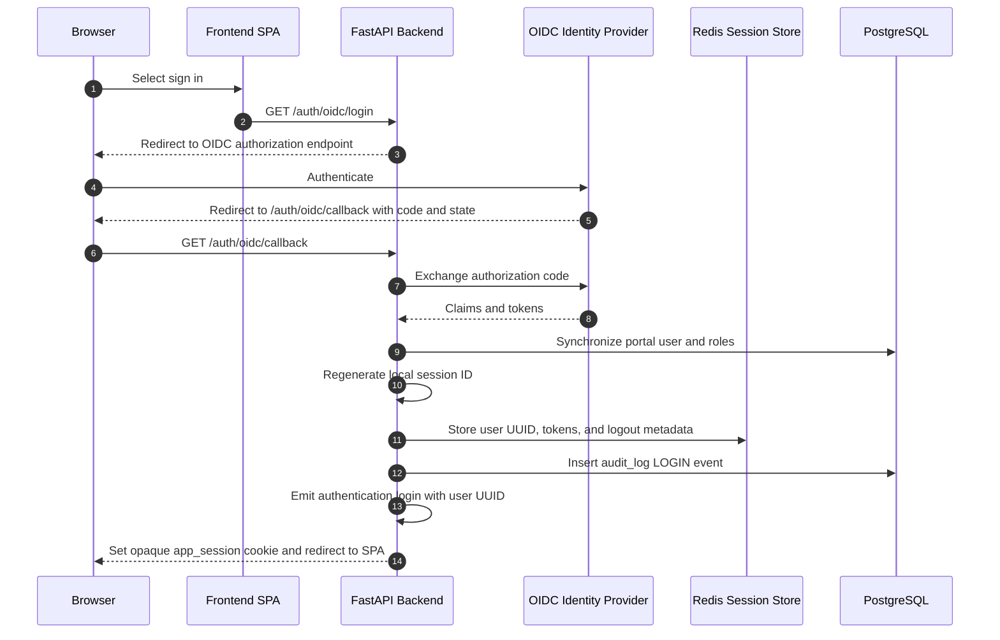
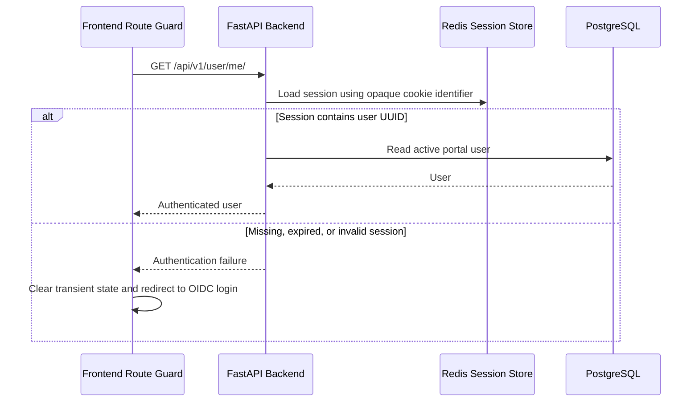
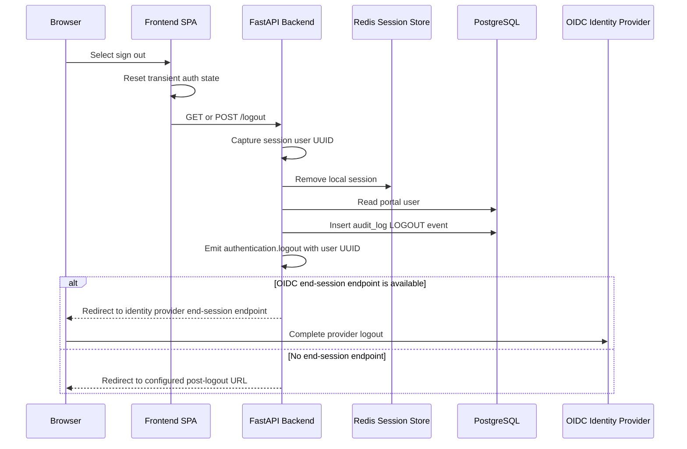
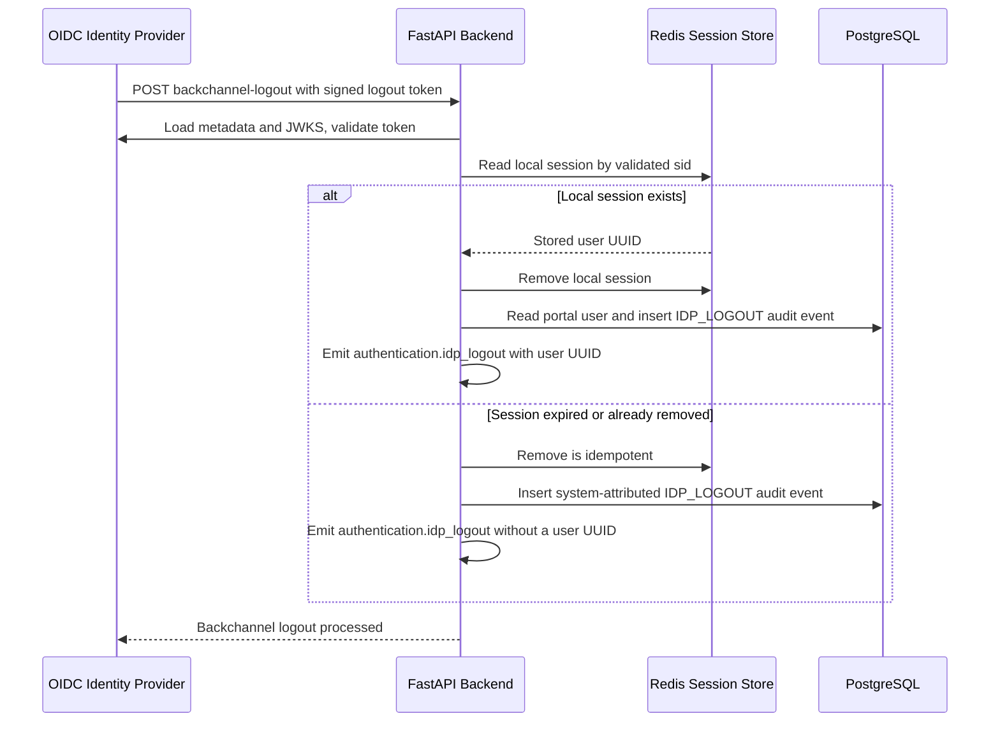
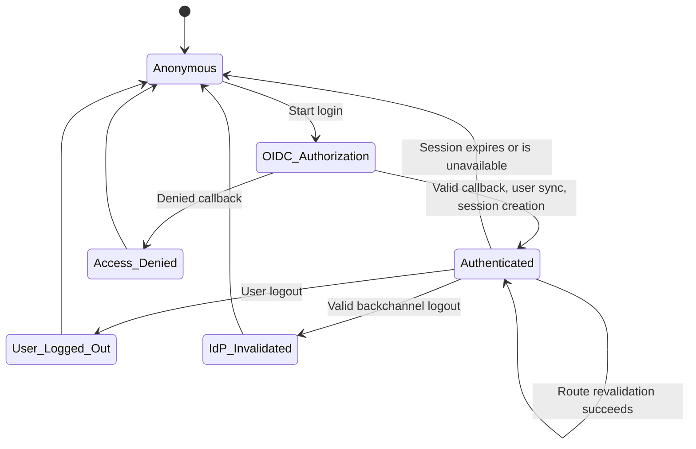

# Authenticated Session Lifecycle

This guide describes how the Partner Portal creates, validates, and invalidates authenticated browser sessions. It is the canonical design reference for the OIDC services, Redis-backed Starsessions store, PostgreSQL audit trail, and authentication console events.

## Trust Boundaries And Stored Data

| Boundary | Responsibility | Data retained |
| --- | --- | --- |
| Browser | Sends the opaque `app_session` cookie over configured cookie scope | Session identifier only |
| Frontend SPA | Starts OIDC login and revalidates server state on protected route entry | Transient user state only |
| FastAPI backend | Exchanges OIDC code, synchronizes the portal user, and authorizes requests | Request-scoped session access |
| OIDC identity provider | Authenticates users and sends signed backchannel logout tokens | Identity-provider session state |
| Redis | Stores the server-side Starsessions record | `user_uuid`, OIDC tokens, and logout metadata |
| PostgreSQL | Stores portal users and durable audit records | Authentication event metadata |

Tokens, ID tokens, opaque cookies, local session IDs, OIDC `sid` values, and raw logout tokens must never be written to the audit table or application console logs.

## Successful Login

The frontend directs a user to `GET /api/v1/auth/oidc/login`. The backend uses the authorization-code flow and returns the browser to the configured post-login URL only after it has synchronized the portal user and created the server-side session.

A callback denied by portal access rules clears the transient session and redirects to the configured access-denied page. It does not produce a successful `LOGIN` event.

## Session Validation

Protected frontend routes call `revalidateCurrentUser()` before relying on cached Zustand state. The request reaches `get_current_user()`, which resolves an active portal user from the server-side session first. A bearer token is only a fallback when no valid session user is present. When revalidation fails, the frontend redirects the browser to OIDC login rather than trusting cached client state.

Sessions have a fixed lifetime unless `SESSION_ROLLING` is enabled. The relevant OIDC, cookie, and Redis settings are documented in [Configuration](../../getting-started/configuration.md).

## User-Initiated Logout

The frontend clears its transient auth state before navigating to `GET /api/v1/logout`; API clients can also use `POST /api/v1/logout`. The backend captures the authenticated user identity before clearing the session, removes the server-side record, records the transition, and returns or redirects to the OIDC end-session endpoint when configured.

A logout request without a session remains idempotent: it clears local client/server session state but does not create a user-attributed logout event.

## Identity-Provider Backchannel Logout

The identity provider can end a portal session without a browser request by posting a signed logout token to `POST /api/v1/auth/oidc/backchannel-logout`. The backend validates issuer, audience, backchannel event, nonce absence, and `sid` before it reads and removes the matching local session.

Invalid logout tokens do not remove a local session and do not create an authentication event.

## Authentication State Model

## Audit And Console Events

Each completed local state transition writes one immutable `audit_log` record and one corresponding `INFO` console event.

| Transition | Audit target and operation | Console event | Attribution |
| --- | --- | --- | --- |
| Successful OIDC callback | `authentication` / `LOGIN` | `authentication.login` | Portal user UUID |
| User-initiated logout | `authentication` / `LOGOUT` | `authentication.logout` | Portal user UUID |
| Valid backchannel logout | `authentication` / `IDP_LOGOUT` | `authentication.idp_logout` | Portal user UUID when the local session remains; otherwise system audit identity and no console user UUID |

Console events include only the stable event name and `user_uuid` when available. Audit descriptions intentionally use metadata-only text. Neither output is a source of credentials or session material.

## Operational Notes

- The session cookie domain must match the browser host. In integration tests using a `testserver` host, set `SESSION_COOKIE_DOMAIN` to `None` so the cookie round-trips.
- Register `OIDC_REDIRECT_URI` exactly with the identity provider to avoid callback `redirect_uri` mismatches.
- Backchannel logout relies on the validated OIDC `sid` being used to locate the local session. A missing local record is expected after expiry or an earlier logout and is handled as an idempotent system event.
