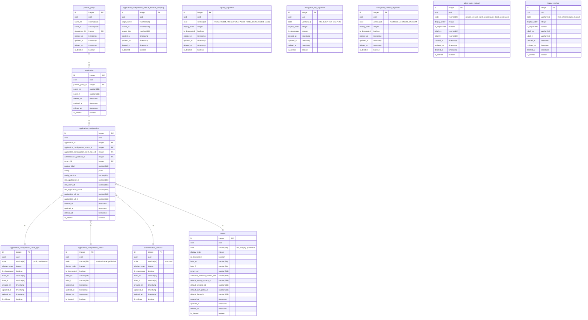

# Partner Portal RP Configuration ERD

```mermaid
erDiagram
    partner_group ||--o{ application : fk
    application ||--o{ application_configuration : fk
    application_configuration }o--|| application_configuration_client_type : fk
    application_configuration }o--|| application_configuration_status : fk
    application_configuration }o--|| authentication_protocol : fk
    application_configuration }o--|| tenant : fk
    
    partner_group {
        id integer PK
        uuid uuid
        name_en varchar(256)
        name_fr varchar(256)
        department_id integer FK
        created_at timestamp
        updated_at timestamp
        deleted_at timestamp
        is_deleted boolean
    }

    application {
        id integer PK
        uuid uuid
        partner_group_id integer FK
        name_en varchar(256)
        name_fr varchar(256)
        created_at timestamp
        updated_at timestamp
        deleted_at timestamp
        is_deleted boolean
    }

    application_configuration {
        id integer PK
        uuid uuid
        application_id integer FK
        application_configuration_status_id integer FK
        application_configuration_client_type_id integer FK
        authentication_protocol_id integer FK
        tenant_id integer FK

        partner_label varchar(512)
        config jsonb
        config_version varchar(32)

        ibm_application_id varchar(128)
        ibm_client_id varchar(128)
        dnr_application_name varchar(128)
        application_url_en varchar(512)
        application_url_fr varchar(512)

        created_at timestamp
        updated_at timestamp
        deleted_at timestamp
        is_deleted boolean        
    }

    application_configuration_status {
        id integer PK
        uuid uuid
        code varchar(64) "draft,submitted,published"
        display_order integer
        is_deprecated boolean
        label_en varchar(64) 
        label_fr varchar(64)
        created_at timestamp
        updated_at timestamp
        deleted_at timestamp
        is_deleted boolean
    }

    application_configuration_default_attribute_mapping {
        id integer PK
        uuid uuid
        target_name varchar(128)
        source_id varchar(128)
        source_kind varchar(128)
        created_at timestamp
        updated_at timestamp
        deleted_at timestamp
        is_deleted boolean
    }

    tenant {
        id integer PK
        uuid uuid
        code varchar(64) "test, staging, production"
        display_order integer
        is_deprecated boolean
        label_en varchar(64)
        label_fr varchar(64)
        tenant_url varchar(512)
        authorize_endpoint_context_salt varchar(128)
        default_identity_source_id varchar(256)
        default_template_id varchar(256)
        default_auth_policy_id varchar(256)
        default_theme_id varchar(128)
        created_at timestamp
        updated_at timestamp
        deleted_at timestamp
        is_deleted boolean
    }

    signing_algorithm {
        id integer PK
        uuid uuid
        code varchar(64) "RS256, RS384, RS512, PS256, PS384, PS512, ES256, ES384, ES512"
        display_order integer
        is_deprecated boolean
        created_at timestamp
        updated_at timestamp
        deleted_at timestamp
        is_deleted boolean
    }

    encryption_key_algorithm {
        id integer PK
        uuid uuid
        code varchar(64) "RSA-OAEP, RSA-OAEP-256"
        display_order integer
        is_deprecated boolean
        created_at timestamp
        updated_at timestamp
        deleted_at timestamp
        is_deleted boolean
    }

    encryption_content_algorithm {
        id integer PK
        uuid uuid
        code varchar(64) "A128GCM, A192GCM, A256GCM"
        display_order integer
        is_deprecated boolean
        created_at timestamp
        updated_at timestamp
        deleted_at timestamp
        is_deleted boolean
    }

    application_configuration_client_type {
        id integer PK
        uuid uuid
        code varchar(64) "public, confidential"
        display_order integer
        is_deprecated boolean
        label_en varchar(64)
        label_fr varchar(64)
        created_at timestamp
        updated_at timestamp
        deleted_at timestamp
        is_deleted boolean
    }

    client_auth_method {
        id integer PK
        uuid uuid
        code varchar(64) "private_key_jwt, client_secret_basic, client_secret_post"
        display_order integer
        is_deprecated boolean
        label_en varchar(64)
        label_fr varchar(64)
        created_at timestamp
        updated_at timestamp
        deleted_at timestamp
        is_deleted boolean
    }

    logout_method {
        id integer PK
        uuid uuid
        code varchar(64) "front_channel,back_channel"
        display_order integer
        is_deprecated boolean
        label_en varchar(64)
        label_fr varchar(64)
        created_at timestamp
        updated_at timestamp
        deleted_at timestamp
        is_deleted boolean
    }

    authentication_protocol {
        id integer PK
        uuid uuid
        code varchar(64) "oidc,saml"
        display_order integer
        is_deprecated boolean
        label_en varchar(64)
        label_fr varchar(64)
        created_at timestamp
        updated_at timestamp
        deleted_at timestamp
        is_deleted boolean
    }

```