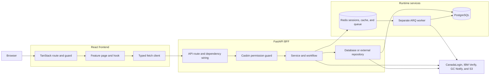

# Codebase Architecture

Type: Architecture Note
Status: Active
Last verified: 2026-08-11

## Context

The CanadaLogin Partner Portal is a browser application with a React frontend,
a FastAPI backend-for-frontend (BFF), PostgreSQL persistence, Redis-backed
runtime services, and integrations with CanadaLogin, IBM Security Verify,
GC Notify, and AWS S3.

This note describes the current codebase shape and the dependency direction new
work should preserve. It does not turn known legacy exceptions into preferred
patterns.

## System Boundary

The portal owns:

- browser navigation and user-facing portal workflows;
- the browser session and current-user projection;
- local users, roles, departments, access policies, RP application metadata,
  and audit data;
- orchestration of IBM Security Verify, GC Notify, and MAU data access; and
- asynchronous synchronization and data-loading jobs.

CanadaLogin remains the OIDC identity provider. IBM Security Verify, GC Notify,
and AWS S3 remain external systems.



## Key Components

| Area | Current responsibility |
|---|---|
| `frontend/src/routes/` | File-based URLs, route entry checks, loaders, and page selection. |
| `frontend/src/features/` | Feature pages, hooks, and user-flow orchestration. |
| `frontend/src/fetch/` | Shared request handling and typed API clients. |
| `frontend/src/store/` | Client-side session projection, preferences, and other app state. |
| `backend/src/app/api/` | HTTP routes, dependency injection, response models, and permission decorators. |
| `backend/src/app/services/` | Business rules, orchestration, and calls to repositories or the queue. |
| `backend/src/app/repositories/` | SQLAlchemy/FastCRUD access and adapters for external systems. |
| `backend/src/app/workflows/` | Explicit lifecycle transition logic where a domain has state transitions. |
| `backend/src/app/models/` | SQLAlchemy persistence models. |
| `backend/src/app/schemas/` | Pydantic request, response, and internal transfer models. |
| `backend/src/app/core/` | Configuration, sessions, authorization, exceptions, caching, logging, and workers. |

## Backend Architecture

The intended dependency direction is:

```text
API route -> service or workflow -> repository -> database or external system
```

Routes own HTTP concerns: route declarations, request and response schemas,
dependency injection, status codes, and permission guards. Services own
business validation and orchestration. Repositories own persistence and
external I/O details. Existing routes that bypass these boundaries are legacy
exceptions and are not templates for new work.

Database-backed features commonly separate SQLAlchemy models, Pydantic create,
update and read schemas, FastCRUD repository adapters, services, routes,
migrations, and tests. The exact schema mixins and public identifier vary by
domain; copy the closest maintained feature instead of forcing one universal
shape.

## Frontend Architecture

The intended dependency direction is:

```text
route -> feature page or hook -> typed fetch client -> backend API
```

Route files stay focused on navigation and route-entry behaviour. Feature pages
assemble the interface, while feature hooks normally own TanStack Query
orchestration. Low-level HTTP behaviour stays in `frontend/src/fetch/`.

TanStack Query owns server-backed data. Zustand holds client-side state such as
the current-user projection and preferences; it is not an authorization
authority. Shared layout and UI wrappers are reused before introducing new
primitives.

## Data And API Contracts

FastAPI routes return explicit Pydantic response models where practical, and
frontend clients define TypeScript types that match the serialized wire
contract.

Field naming is not yet consistent across every endpoint: many Pydantic schemas
serialize camelCase aliases, while MAU and some list/client contracts still use
snake_case. [ADR-002](adrs/adr-002-api-wire-and-error-contract.md) records the
proposed direction and the work needed before it can be accepted. Until then,
preserve each endpoint's implemented contract and treat casing changes as API
changes.

Handled backend errors currently use:

```json
{
  "error": {
    "code": "machine_readable_code",
    "message": "Safe user-facing message",
    "details": {},
    "requestId": "optional-request-id"
  }
}
```

The central exception handlers and OpenAPI error helper own this shape.

## Authentication And Authorization

The backend is the browser-facing BFF. It performs the OIDC exchange and keeps
OIDC tokens and identity context in a Redis-backed server session. The browser
uses the session cookie and does not store OIDC tokens. Protected frontend route
entry revalidates the backend session; cached Zustand state is only a UI
projection. This accepted boundary is recorded in
[ADR-001](adrs/adr-001-bff-and-server-session-authority.md).

Protected backend routes use code-owned Casbin resource/action policy for
coarse capability checks. Stable canonical role keys are the only policy
subjects. Server-owned normalized assignments resolve one global CL Admin role
or one partner role per workspace, and services still enforce workspace,
object, lifecycle, and domain constraints before data access. The safe
current-user projection exposes role and public workspace context without
policy internals. This accepted boundary is recorded in
[ADR-003](adrs/adr-003-casbin-authorization-model.md).

## Background Processing

ARQ jobs live under `backend/src/app/core/worker/`. Services enqueue work
through the shared Redis queue. Registered functions and cron jobs live in
`WorkerSettings`.

The worker runs as a separate process, using `make bk-worker`, the ARQ CLI, or
the `worker` service in `backend/docker-compose.yml`. FastAPI startup creates
the queue pool; it does not spawn a daemon worker thread.

## Security, Privacy, Accessibility, And Operations

- Backend permission checks remain authoritative even when the frontend hides
  or redirects UI.
- Secrets and real `.env` files are not committed.
- External systems are accessed through backend services or repositories, not
  directly from the browser.
- GC Design System wrappers and the configured accessibility linting remain the
  frontend baseline.
- PostgreSQL is persistent state. Redis supports sessions, cache, queueing, and
  rate limiting through separately configured clients.
- Migrations are the tracked path for database structure. Canonical capability
  policy is immutable, code-owned configuration; normalized assignment and
  grant lifecycle changes use reviewed migrations and services.

## Decisions And Open Questions

- ADR-001 is accepted and describes the implemented browser-session boundary.
- ADR-002 is proposed until JSON casing drift is inventoried and reconciled.
- ADR-003 is accepted and defines the deterministic four-role authorization
  model, stable policy subjects, normalized assignment sources, workspace
  scope, and CL Admin secret boundary.
- Some generic backend and frontend documentation predates the current portal
  architecture. The implementation, accepted ADRs, and this note take
  precedence when those documents conflict.

## Risks Or Trade-Offs

- Strict layering adds files but keeps HTTP, business logic, persistence, and
  external integration concerns independently testable.
- Route-entry session revalidation adds a backend request but prevents stale
  client state from becoming authentication evidence.
- Mixed API casing creates contract drift risk until ADR-002 is resolved.
- A separate worker process adds operational coordination but isolates scheduled
  and retryable work from web requests.

## Links

- [Development conventions](../repo-guidance/development-conventions.md)
- [MVP architecture planning document](../plans/partner-portal-mvp-architecture.md)
- [Infrastructure architecture planning document](../plans/partner-portal-system-architecture.md)
- [MVP data flows](../plans/partner-portal-mvp-data-flows.md)
- [MVP dependency inventory](../plans/partner-portal-mvp-dependencies.md)
