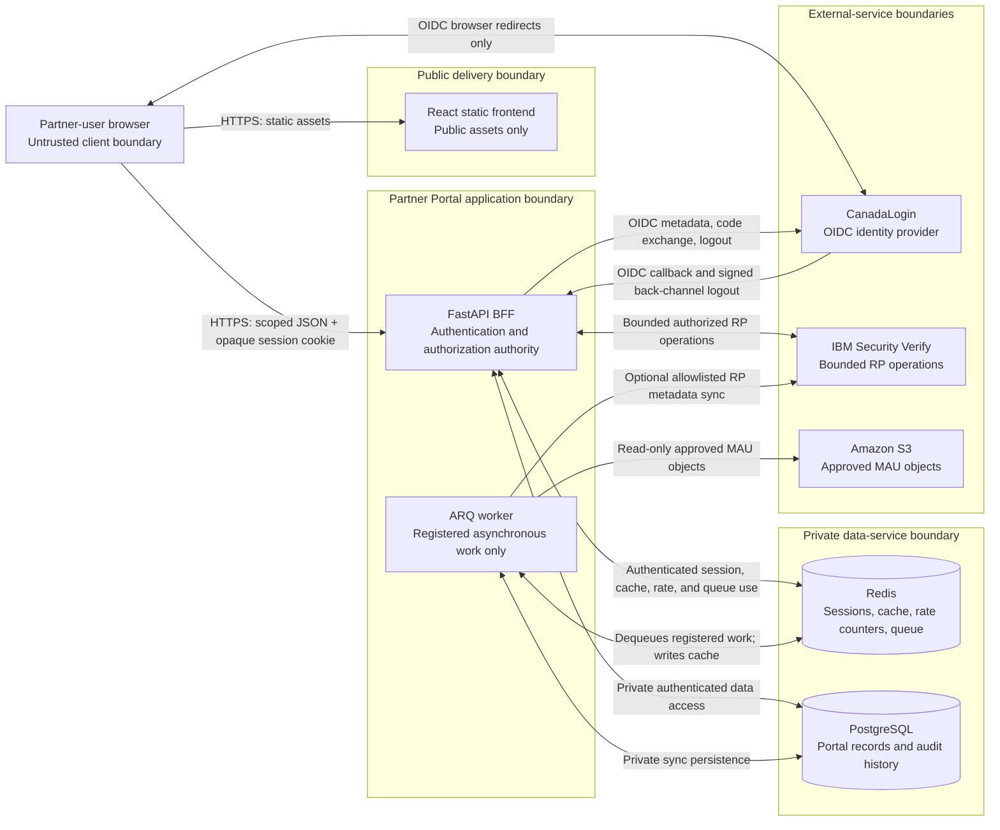

# Trust Boundaries and Permitted Information Flows

Type: Architecture Security Note
Status: Active
Last reviewed: 2026-08-28

## Purpose and Scope

This note identifies the runtime trust boundaries and permitted information
flows for the CanadaLogin Partner Portal. It is the solution-specific
architecture record supporting `GC-WEB-007: Security` and `GC-WEB-008:
Identity And Access`; it complements, but does not replace, target-environment
network, IAM, privacy, and release approval evidence.

The scope is the deployed React frontend, FastAPI backend-for-frontend (BFF),
Redis, PostgreSQL, ARQ worker, CanadaLogin, IBM Security Verify, and Amazon
S3. The intended deployment model is the infrastructure architecture described
in [partner-portal-system-architecture.md](../plans/partner-portal-system-architecture.md).
This note does not approve a shared non-production or production environment.

## Trust-Boundary Overview

An AWS account or network location does not itself create trust. The frontend
hosting bucket and the MAU bucket have different purposes and access rules.
The S3 MAU source remains an external data boundary even when it is hosted in
an approved AWS account.

## Boundary Rules

| ID | Boundary | Trust decision and required control |
| -- | -------- | ----------------------------------- |
| TB-01 | Browser to frontend | The browser is untrusted. Static assets are public delivery content only and must not contain secrets, provider credentials, server connection strings, or private data. `VITE_*` settings are public build-time configuration. |
| TB-02 | Browser to BFF | The BFF is the sole browser-facing authority for authentication, authorization, validation, and data access. The browser presents an opaque, secure session cookie; it does not store CanadaLogin OIDC tokens. CORS, cookie domain, `Secure`, `SameSite`, and request-forgery controls are target-environment requirements. |
| TB-03 | Portal workload to data services | Redis and PostgreSQL are private services. Their network and credential policies permit only the BFF and, where listed below, the ARQ worker. They have no public ingress and accept no browser connection. Separate Redis clients/settings isolate session, cache, queue, and rate-limit uses. |
| TB-04 | Portal workload to identity and provider services | CanadaLogin and IBM Security Verify are external service boundaries. The browser never calls their management APIs. The BFF owns CanadaLogin OIDC exchanges. The BFF and an explicitly enabled ARQ synchronization job use only the bounded IBM Verify adapter and approved workload credentials. |
| TB-05 | Worker to S3 MAU source | The worker is the only runtime component permitted to retrieve MAU objects. Its workload identity must be limited to `GetObject` for the configured approved bucket and prefix. S3 write, delete, bucket administration, object listing outside the approved prefix, and browser access are not permitted flows. |

## Permitted Information Flows

| ID | Source to destination | Permitted information and purpose | Required constraints |
| -- | --------------------- | --------------------------------- | -------------------- |
| PF-01 | Browser to frontend | Requests and receives public static HTML, JavaScript, CSS, and media over HTTPS. | Do not embed secrets, private API responses, OIDC tokens, or IBM/S3 credentials in the build. |
| PF-02 | Browser to BFF | Scoped JSON requests and responses for portal workflows; opaque session cookie; a secret value only in the explicitly authorized one-time reveal response. | TLS; server-side schema validation; authentication, canonical-role, workspace, object, and lifecycle checks before data or actions; safe errors; no client-side authorization authority. A CL Admin must never receive an RP secret value. |
| PF-03 | Browser to CanadaLogin | Authorization and logout redirects needed by the OIDC authorization-code flow. | This is a browser redirect, not a frontend management integration. Browser storage must not contain OIDC access, refresh, or ID tokens. |
| PF-04 | BFF to/from CanadaLogin | OIDC discovery, authorization-code exchange, verified identity claims, and logout processing. CanadaLogin may call the BFF's configured OIDC callback and signed back-channel logout endpoints. | Only the BFF initiates outbound OIDC service calls. Validate callback state and the logout-token issuer, signature, audience, event, and session identifier before changing a server session. Provider tokens and identity context remain in the Redis-backed server session and are excluded from logs and frontend storage. |
| PF-05 | BFF to PostgreSQL | Portal-owned users, role references and assignments, workspace and RP configuration records, invitation hashes and history, workflow records, and required audit history. | Private authenticated connection; parameterized repository access; migration-controlled schema; authorization occurs before records are returned or changed. PostgreSQL is not used as a browser session or provider-token store. |
| PF-06 | BFF to Redis | Server sessions, caches, runtime rate-limit counters, and ARQ job enqueue/dequeue state. | Private authenticated connection with TLS in shared environments; Redis session contents, including provider tokens, are never returned to the browser or written to application logs. |
| PF-07 | BFF to ARQ worker through Redis | Queued work requests for registered handlers only. | The BFF does not execute arbitrary user-supplied jobs, and the worker has no HTTP endpoint reachable from the browser. Job inputs must be minimal and must not contain secret values or raw bearer invitation tokens. |
| PF-08 | ARQ worker to Redis and PostgreSQL | Redis queue consumption and MAU-cache writes; portal-record writes from the optional IBM Verify RP metadata synchronization job. | Private authenticated connections. The worker receives only its workload role; it does not inherit a browser session or user authority. |
| PF-09 | BFF to IBM Security Verify | Authorized RP application configuration, credential lifecycle, and scoped usage operations through the bounded adapter. | TLS and approved IBM client credentials; server-side authorization and object scope occur before client creation or provider access. No generic IBM administration surface is exposed to the browser. |
| PF-10 | ARQ worker to IBM Security Verify | Optional scheduled synchronization of RP application metadata when `IBM_RP_APPLICATION_SYNC_ENABLED` is explicitly enabled. | TLS, bounded read/synchronization operations, private workload credentials, time-window/feature enablement, and persistence only through the portal service. This job does not reveal or distribute client-secret values. |
| PF-11 | ARQ worker to Amazon S3 | Read approved MAU CSV objects, then cache scoped MAU records in Redis. | Read-only prefix-scoped workload identity, expected CSV schema parsing, no S3 response sent directly to the browser, and no S3 writes or deletes. The BFF returns only MAU data for an RP configuration that the current principal may access. |

## Explicitly Denied Flows

- Frontend or browser direct access to PostgreSQL, Redis, ARQ, IBM Security
  Verify management APIs, or the MAU S3 bucket.
- ARQ worker access to browser sessions, browser cookies, or CanadaLogin OIDC
  endpoints.
- Direct CanadaLogin-to-PostgreSQL/Redis/S3/IBM integrations.
- PostgreSQL or Redis public ingress, and data-service access by any workload
  other than the explicitly approved BFF or worker identity.
- S3 writes, deletes, administrative actions, or unbounded object retrieval by
  the MAU ingestion workload.
- OIDC tokens, IBM Verify workload credentials, Redis/PostgreSQL credentials,
  RP secret values, or raw invitation bearer tokens in frontend bundles,
  browser storage, URLs, logs, analytics, audit exports, or ordinary API list
  and detail responses.

## Information-Handling Rules

| Information class | Permitted locations and handling |
| ----------------- | -------------------------------- |
| Public frontend assets | Frontend delivery path and browser cache only; never a carrier for private configuration or secrets. |
| Verified identity claims and OIDC tokens | BFF processing and Redis server session only. Return only the safe current-user projection to the browser. |
| Portal business and audit records | PostgreSQL, subject to the record ownership, retention, disposition, backup, and access requirements selected for the target environment. |
| RP secret values and provider credentials | IBM Security Verify and protected BFF memory during the authorized operation; an RP secret value may cross to an authorized RP user only through its dedicated one-time reveal response. Never persist or log it in Redis, PostgreSQL, audit records, or frontend state. |
| MAU source data | Approved S3 bucket/prefix, worker memory, and Redis cache. The BFF releases only authorization-scoped report data. |
| Invitation bearer token | Authorized recipient URL at issuance/acceptance only; store and retain the hash and lifecycle metadata in PostgreSQL. Exclude raw tokens from logs, analytics, referrers, and responses after issuance. |

## Enforcement and Verification

The implemented boundary direction is evidenced by the BFF OIDC service,
separate Redis session/queue/cache clients, ARQ registration, bounded IBM
adapter, and S3 reader:

- [OIDC service](../../backend/src/app/services/oidc_service.py) keeps the
  token bundle in the server session after the authorization-code callback.
- [Runtime setup](../../backend/src/app/core/setup.py) creates separate Redis
  session, cache, queue, and rate-limit clients; it also creates the bounded
  IBM client.
- [ARQ worker functions](../../backend/src/app/core/worker/functions.py) show
  the optional IBM metadata synchronization and the MAU-cache load path.
- [S3 repository](../../backend/src/app/repositories/s3_repository.py) issues
  an S3 `GetObject` request for the configured bucket and object key.
- [IBM Verify repository](../../backend/src/app/repositories/ibm_sv_admin.py)
  exposes the bounded portal operations rather than a generic HTTP proxy.

Before a shared non-production or production deployment, the owning platform
and security teams must verify and preserve evidence for: network security
groups/firewall rules; explicit TLS and service authentication for Redis and
PostgreSQL; BFF and worker workload identities; S3 bucket and prefix policy;
IBM Verify and CanadaLogin endpoint allowlists; secure-cookie, CORS, and
request-forgery settings; secret-store references; and logging/redaction
configuration. Any new cross-boundary destination, privilege, data class, or
flow requires security review and an update to this note and, when durable, an
ADR.

## Related Architecture

- [Codebase architecture](codebase.md)
- [ADR-001: BFF and Server Session Authority](adrs/adr-001-bff-and-server-session-authority.md)
- [Infrastructure architecture](../plans/partner-portal-system-architecture.md)
- [Partner Portal onboarding PRD](../plans/partner-portal-onboarding-prd.md)