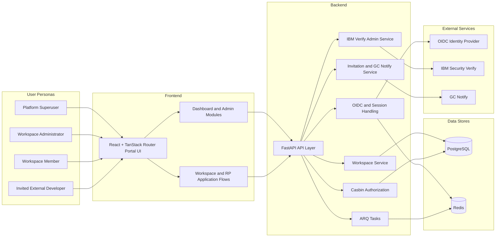
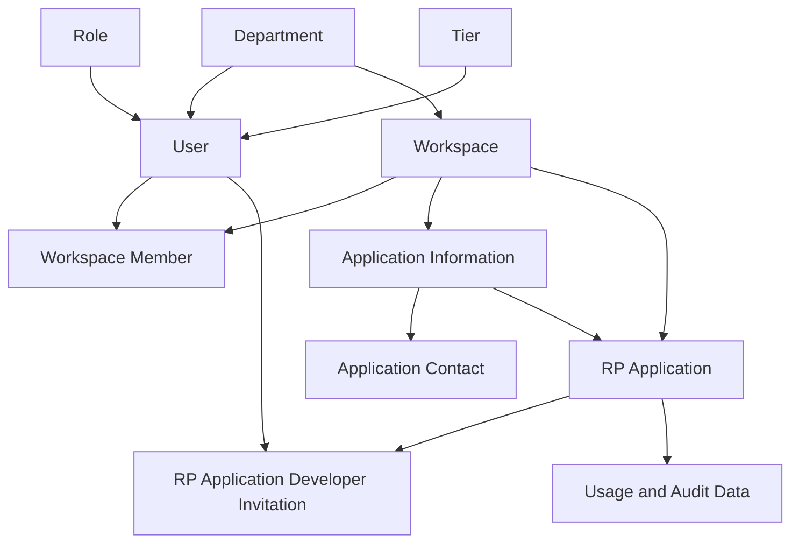
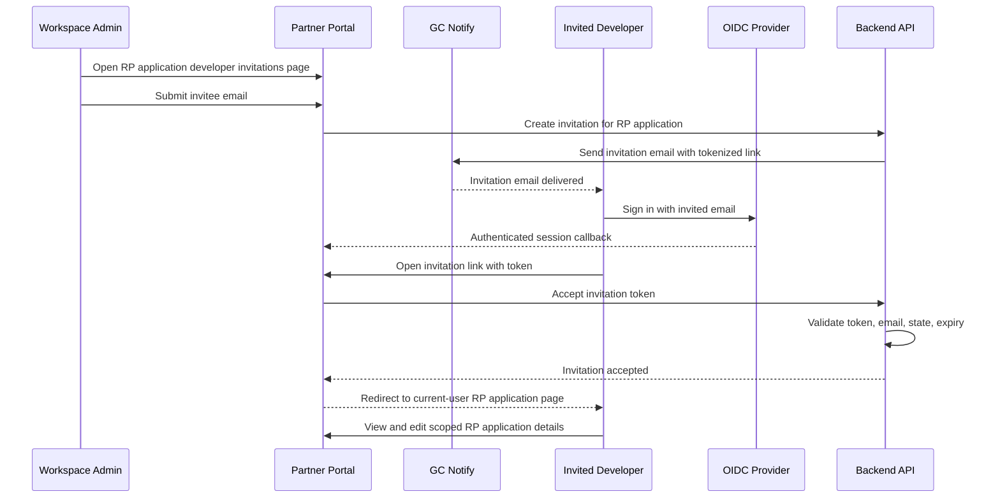
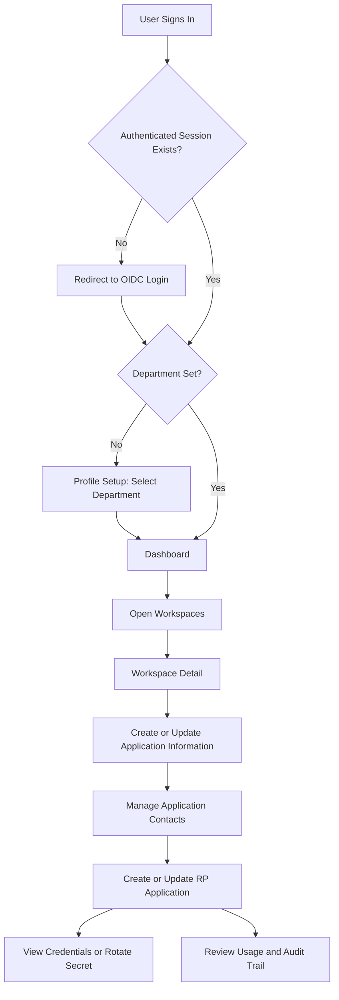
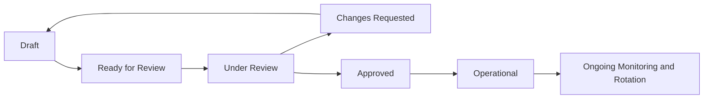

# CanadaLogin Partner Portal Diagrams

## Document Status

- Status: Draft
- Date: 2026-05-13
- Purpose: Companion architecture and workflow diagrams for the product PRD

## 1. System Architecture

## 2. Workspace And RP Application Domain Model

## 3. Invited Developer Workflow

## 4. Internal Onboarding Workflow

## 5. Future-State Workflow Anchor

This diagram captures the intended future workflow implied by the backlog and PRD roadmap.

