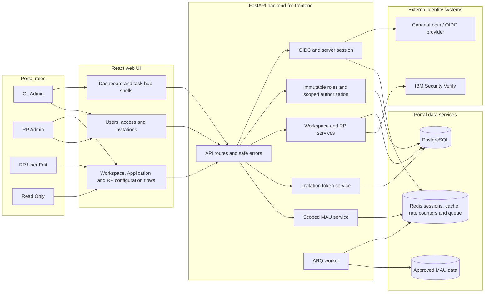
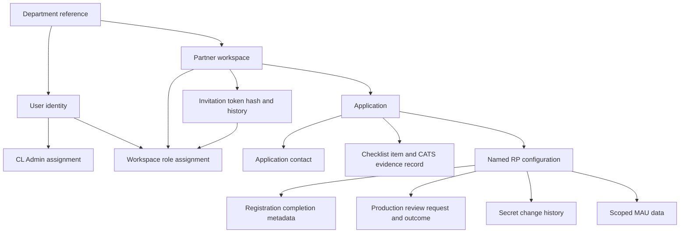
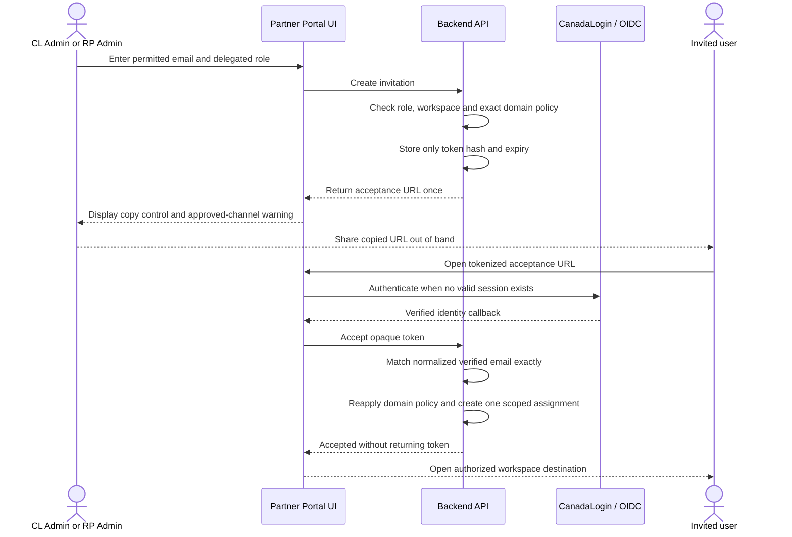
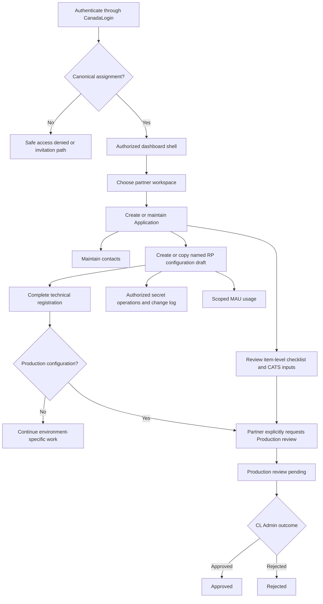
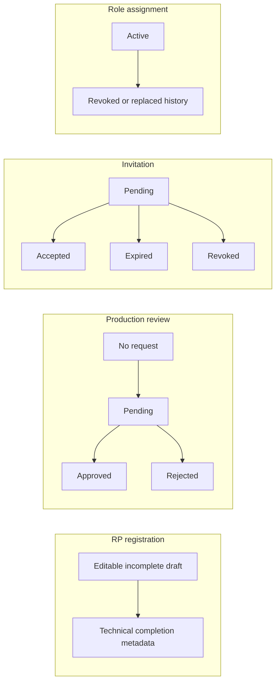

# CanadaLogin Partner Portal Diagrams

## Document Status

- Status: Scope-aligned draft
- Last reviewed: 2026-08-25
- Purpose: Companion architecture and workflow diagrams for the approved
  Partner Portal scope
- Requirement sources: explicit approved decisions in the active
  [`align-partner-portal-to-approved-product-scope`](../../openspec/changes/align-partner-portal-to-approved-product-scope/)
  change and confirmed expansions in the
  [onboarding PRD](partner-portal-onboarding-prd.md), then the
  [MVP PRD](partner-portal-mvp.md) as fallback

The [broader historical PRD](partner-portal-prd.md) and its derived backlog are
not requirements for these diagrams.

## 1. System Architecture

```mermaid
flowchart LR
    subgraph People[Portal roles]
        CL[CL Admin]
        RPA[RP Admin]
        RPE[RP User Edit]
        RO[Read Only]
    end

    subgraph Frontend[React web UI]
        Shell[Dashboard and task-hub shells]
        Partner[Workspace, Application and RP configuration flows]
        Access[Users, access and invitations]
    end

    subgraph Backend[FastAPI backend-for-frontend]
        API[API routes and safe errors]
        Auth[OIDC and server session]
        Authorization[Immutable roles and scoped authorization]
        Workspace[Workspace and RP services]
        Invitations[Invitation token service]
        MAU[Scoped MAU service]
        Worker[ARQ worker]
    end

    subgraph Data[Portal data services]
        PG[(PostgreSQL)]
        Redis[(Redis sessions, cache, rate counters and queue)]
        S3[(Approved MAU data)]
    end

    subgraph External[External identity systems]
        OIDC[CanadaLogin / OIDC provider]
        IBM[IBM Security Verify]
    end

    CL --> Shell
    RPA --> Partner
    RPE --> Partner
    RO --> Partner
    CL --> Access
    RPA --> Access

    Shell --> API
    Partner --> API
    Access --> API
    API --> Auth
    API --> Authorization
    API --> Workspace
    API --> Invitations
    API --> MAU
    Auth --> OIDC
    Auth --> Redis
    Authorization --> PG
    Workspace --> PG
    Workspace --> IBM
    Invitations --> PG
    MAU --> Redis
    Worker --> Redis
    Worker --> S3
```

Invitation links are returned to an authorized administrator for one-time
display. The external channel used to share a copied link is intentionally not
modelled as a portal dependency.

## 2. Workspace And RP Configuration Domain Model

```mermaid
flowchart TD
    Department[Department reference]
    User[User identity]
    GlobalRole[CL Admin assignment]
    Workspace[Partner workspace]
    WorkspaceAccess[Workspace role assignment]
    Application[Application]
    Contact[Application contact]
    Checklist[Checklist item and CATS evidence record]
    RPConfig[Named RP configuration]
    Registration[Registration completion metadata]
    ProductionReview[Production review request and outcome]
    Invitation[Invitation token hash and history]
    SecretHistory[Secret change history]
    MAU[Scoped MAU data]

    Department --> Workspace
    Department --> User
    User --> GlobalRole
    User --> WorkspaceAccess
    Workspace --> WorkspaceAccess
    Workspace --> Application
    Application --> Contact
    Application --> Checklist
    Application --> RPConfig
    RPConfig --> Registration
    RPConfig --> ProductionReview
    Workspace --> Invitation
    Invitation --> WorkspaceAccess
    RPConfig --> SecretHistory
    RPConfig --> MAU
```

The fixed workspace roles are RP Admin, RP User (Edit), and Read Only. CL Admin
is global and never receives RP secret values. Checklist/CATS records show
item-level evidence or missing inputs; the upload-versus-reference mechanism is
still TBD and there is no overall readiness score. Registration completion and
Production review are separate state domains.

## 3. Manually Shared Invitation Workflow

```mermaid
sequenceDiagram
    actor Admin as CL Admin or RP Admin
    participant Portal as Partner Portal UI
    participant API as Backend API
    participant OIDC as CanadaLogin / OIDC
    actor Invitee as Invited user

    Admin->>Portal: Enter permitted email and delegated role
    Portal->>API: Create invitation
    API->>API: Check role, workspace and exact domain policy
    API->>API: Store only token hash and expiry
    API-->>Portal: Return acceptance URL once
    Portal-->>Admin: Display copy control and approved-channel warning
    Admin-->>Invitee: Share copied URL out of band

    Invitee->>Portal: Open tokenized acceptance URL
    Portal->>OIDC: Authenticate when no valid session exists
    OIDC-->>Portal: Verified identity callback
    Portal->>API: Accept opaque token
    API->>API: Match normalized verified email exactly
    API->>API: Reapply domain policy and create one scoped assignment
    API-->>Portal: Accepted without returning token
    Portal-->>Invitee: Open authorized workspace destination
```

Create and reissue are the only responses that reveal a new URL. Reissue makes
the earlier pending token unusable. Revoke prevents acceptance. Tokens are
excluded from list/detail responses, plaintext persistence, logs, analytics,
evidence, and referrer data.

## 4. Partner Onboarding Workflow

```mermaid
flowchart TD
    Login[Authenticate through CanadaLogin] --> Access{Canonical assignment?}
    Access -- No --> Denied[Safe access denied or invitation path]
    Access -- Yes --> Dashboard[Authorized dashboard shell]
    Dashboard --> Workspaces[Choose partner workspace]
    Workspaces --> Application[Create or maintain Application]
    Application --> Contacts[Maintain contacts]
    Application --> Checklist[Review item-level checklist and CATS inputs]
    Application --> RPConfig[Create or copy named RP configuration draft]
    RPConfig --> Registration[Complete technical registration]
    RPConfig --> Credentials[Authorized secret operations and change log]
    RPConfig --> Usage[Scoped MAU usage]
    Registration --> IsProduction{Production configuration?}
    IsProduction -- No --> Continue[Continue environment-specific work]
    IsProduction -- Yes --> Request[Partner explicitly requests Production review]
    Checklist --> Request
    Request --> Pending[Production review pending]
    Pending --> Outcome{CL Admin outcome}
    Outcome -- Approved --> Approved[Approved]
    Outcome -- Rejected --> Rejected[Rejected]
```

Technical registration completion does not submit a Production review. Copying
to Production creates an independent editable draft. Checklist changes do not
advance review status automatically.

## 5. Separate State Domains

```mermaid
flowchart LR
    subgraph Registration[RP registration]
        Draft[Editable incomplete draft] --> Complete[Technical completion metadata]
    end

    subgraph Review[Production review]
        Absent[No request] --> Pending[Pending]
        Pending --> Approved[Approved]
        Pending --> Rejected[Rejected]
    end

    subgraph Invite[Invitation]
        IPending[Pending] --> Accepted[Accepted]
        IPending --> Expired[Expired]
        IPending --> Revoked[Revoked]
    end

    subgraph Assignment[Role assignment]
        Active[Active] --> Historical[Revoked or replaced history]
    end
```

There is no shared Workspace/Application/RP-configuration lifecycle and no
generic `draft -> submitted -> under review -> approved -> launched` sequence.
