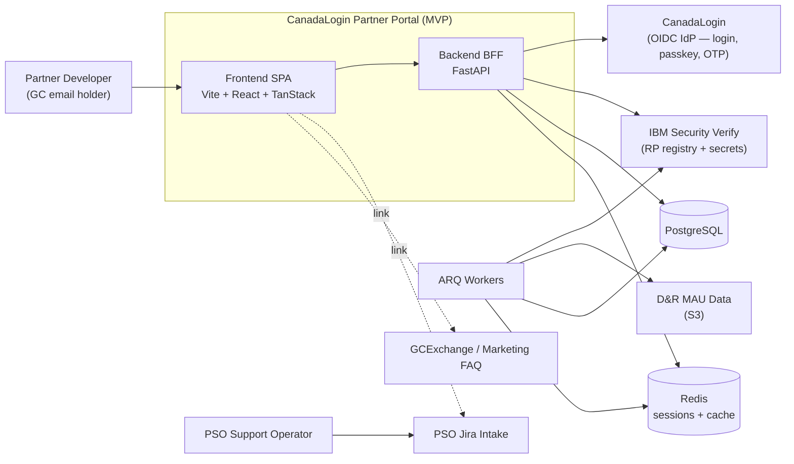
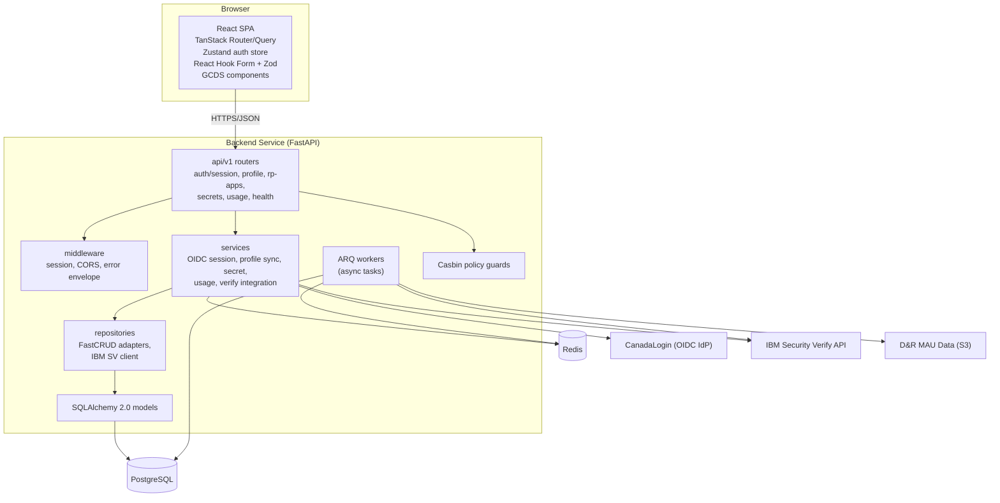
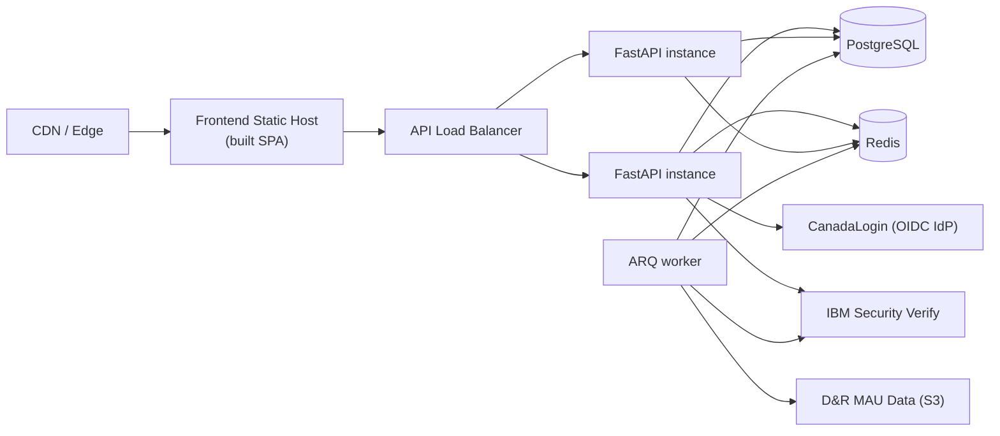

# Partner Portal MVP — Architecture Overview

## Purpose

This document describes the actual components, services, and relationships that make up the CanadaLogin Partner Portal MVP, as scoped in [partner-portal-mvp.md](partner-portal-mvp.md). It is intended to be regenerated or validated for every build so it stays aligned with the deployed system.

## Scope

Only the components required by the four MVP journeys are included:

- Onboarding & Setup
- Manage Secrets
- Monitor & Usage Reporting
- Support & Troubleshooting

## C4-Style Context Diagram

## Container Diagram

## Component Responsibilities

### Frontend (Vite + React)

| Component | Responsibility |
|---|---|
| TanStack Router routes | URL-driven navigation, route guards for auth + onboarding completion |
| Zustand auth store | Holds current session state and onboarding flags |
| React Query | Data fetching, caching, and mutation for backend APIs |
| React Hook Form + Zod | Department selection, secret rotation and regenerate forms |
| GCDS components | Accessible, bilingual UI primitives |
| Feature folders | `auth/`, `rp-applications/`, `secrets/`, `usage/`, `support/` |

### Backend (FastAPI)

| Layer | Responsibility |
|---|---|
| `api/v1` routers | HTTP surface for OIDC auth, departments, RP apps, secrets, MAU report, audit log, health |
| Middleware | Session cookie handling (Redis/starsessions), CORS, shared error envelope |
| Services | Business logic for OIDC user sync, department + terms onboarding, secret lifecycle, MAU read |
| Repositories | FastCRUD adapters over SQLAlchemy, IBM Security Verify admin client, S3 repository |
| Models | User (includes `accepted_terms_at`, `terms_version`), Department, RpApplication, AuditLog |
| Casbin guards | Role-based authorization: `rp_client_secret:read` (view) vs. `rp_client_secret:write` (rotate/regenerate) |
| ARQ workers | Cron: RP config sync from IBM Verify (every 10 min, 06–21 h); MAU load from S3 (hourly at :55, 06–17 h) |

### Backend As BFF

The backend is the browser-facing BFF for the portal SPA, not a generic public API. It owns the browser session, turns OIDC identity claims into the portal user context, and shapes Verify and MAU data into frontend-ready responses.

The BFF layer is responsible for:

- OIDC login and callback handling for browser users (PKCE S256 against CanadaLogin)
- Redis-backed session lifecycle and current-user resolution
- Aggregating IBM Security Verify RP data, department info, and pre-loaded MAU data behind one browser contract
- Keeping the SPA from calling external identity systems directly
- Enforcing Casbin access control before any browser-visible mutation or secret operation

The browser only receives an opaque session cookie. The cookie value is the Redis session identifier, not the OIDC token itself, and the backend regenerates that session identifier after the OIDC callback. The server-side session then holds the portal identity context, including the mapped `user_uuid`, the OIDC token bundle returned from the provider, and logout hints such as the `id_token` and `sid` used to complete single sign-out.

That means:

- The session cookie is the browser's login state; the SPA uses it on every request, but it never needs to read or store OIDC tokens directly.
- The user token state lives in the backend session, where the BFF can exchange it for user context, build logout redirects, and clear it on sign-out.
- Frontend requests stay same-origin and session-based, which keeps the portal contract simple while still preserving OIDC claims for server-side authorization and logout handling.

### Data Stores

| Store | Use |
|---|---|
| PostgreSQL | Persistent state: users (with `accepted_terms_at` + `terms_version`), departments, RP app configurations, audit log |
| Redis | Session store (starsessions), ARQ queue, MAU data cache (`mau:{app_name}`) |

## Deployment View

## Cross-Cutting Concerns

- **AuthN**: OIDC sign-in via CanadaLogin (PKCE S256); passkey, OTP, and identity verification are fully managed by CanadaLogin. Server-side session stored in Redis (starsessions). Backchannel logout supported via `POST /auth/oidc/backchannel-logout`.
- **AuthZ**: Casbin policies enforce `rp_client_secret:read` (view credentials) vs. `rp_client_secret:write` (rotate/regenerate) on secret operations; RP app access scoped to the owning user by email match.
- **Session timeout**: Reviewed policy applied by session middleware; both idle and absolute expiry to be confirmed (see PRD open questions).
- **Observability**: structlog-based structured logs; metrics for sign-up funnel, secret operations, MAU fetches; health and readiness endpoints.
- **Error handling**: Shared `ErrorResponse` envelope from `core/exceptions` registered via the central exception handler.
- **Accessibility**: GCDS components and WCAG 2.1 AA conformance.
- **Internationalization**: i18next on the frontend, bilingual labels for department and onboarding copy.

## Build-Time Outputs

For every build, this document should be regenerated alongside:

- [partner-portal-mvp-data-flows.md](partner-portal-mvp-data-flows.md)
- [partner-portal-mvp-dependencies.md](partner-portal-mvp-dependencies.md)
