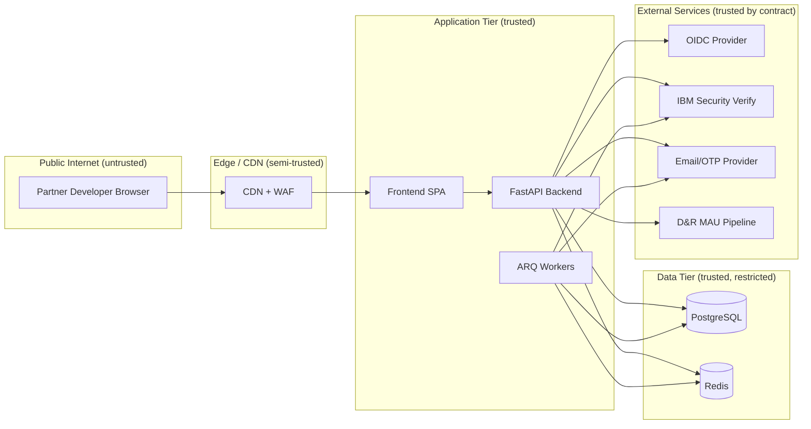
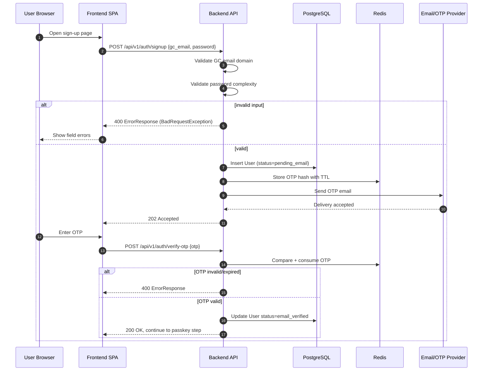
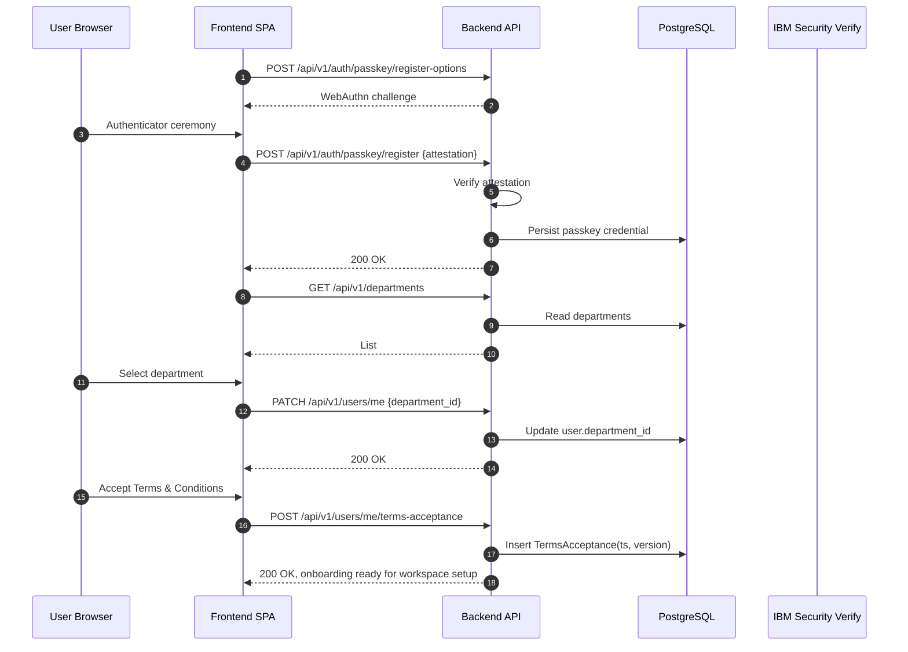
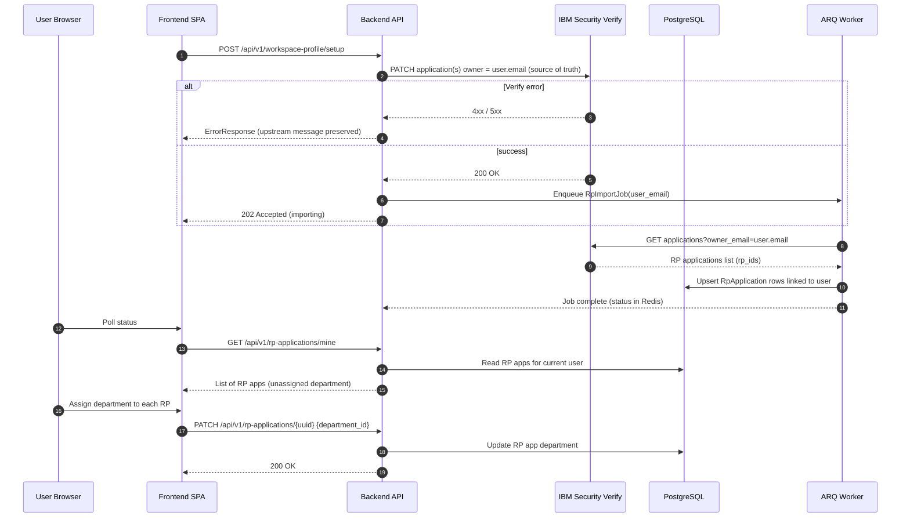
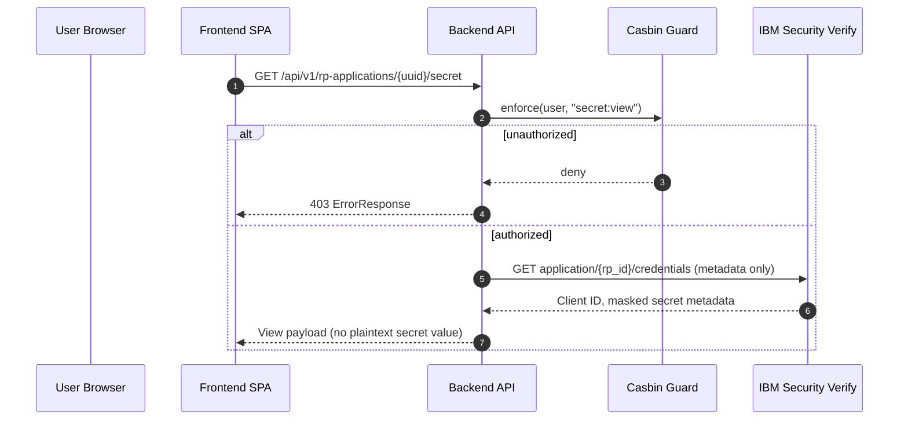
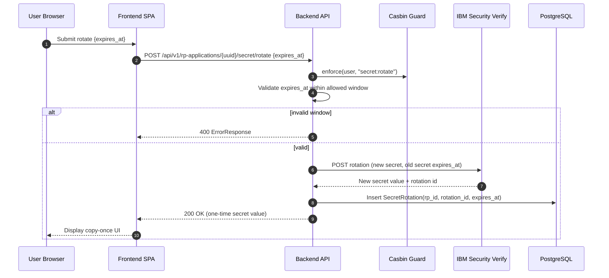
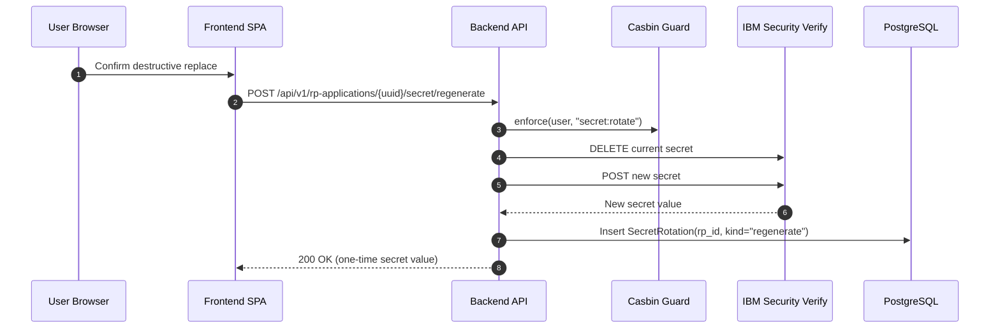
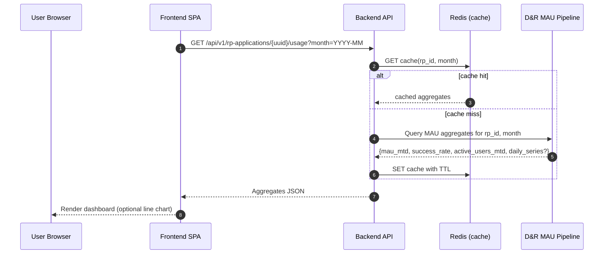
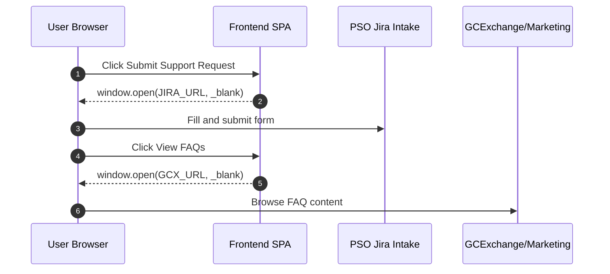
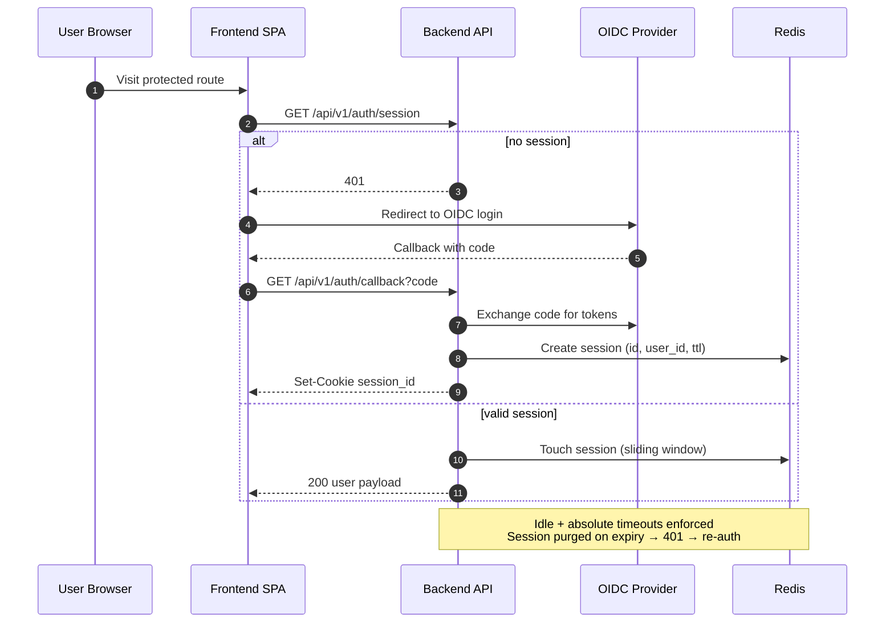

# Partner Portal MVP — Data Flow Diagrams

## Purpose

This document describes how data moves through the CanadaLogin Partner Portal MVP end-to-end, including happy paths, async processes, and error paths. Diagrams are authored in Mermaid so they can be exported and reused by the CDS Valentine threat modeling tool.

## Trust Boundaries

## DFD-1: Sign-Up And Email OTP Validation

Edge cases:
- OTP retries are rate-limited via Redis counters.
- Email delivery failures from the provider raise a `BadGatewayException` and surface a retry CTA to the user.

## DFD-2: Passkey Registration, Department, And Terms

## DFD-3: Workspace Profile Setup And RP Import From IBM Security Verify

Error paths:
- If no RP applications are returned for the user's verified email, the worker records an empty result and the UI shows an explicit empty state (see PRD open question 4).
- Stale Verify ownership data results in a partial import; the user can retry from the UI.

## DFD-4: View Current Secret

## DFD-5: Rotate Secret With Old-Secret Expiry

## DFD-6: Generate New Secret (Immediate Replacement)

Error path: if `DELETE` succeeds but `POST` fails, the service raises an upstream-preserving error and emits a structured log with rotation id for operator recovery.

## DFD-7: MAU Dashboard Read

Edge cases:
- D&R pipeline unavailable → `ServiceUnavailableException`, UI shows degraded state with last cached values when present.
- Invalid month window → `BadRequestException`.

## DFD-8: Support And FAQ Outbound Links

No portal data crosses to these surfaces beyond the user's own browser navigation.

## DFD-9: Authenticated Session Lifecycle (Cross-Cutting)

## Threat Modeling Hand-Off Notes

When importing these DFDs into Valentine, treat the following as primary assets and trust crossings:

- **Assets**: user identity, passkey credentials, OTP codes, session cookies, client secrets, MAU aggregates, terms acceptance records.
- **Trust crossings**: Browser → CDN, CDN → API, API → IBM Security Verify, API → D&R pipeline, API → Email provider, API → OIDC.
- **Highest-risk flows**: DFD-5 and DFD-6 (secret material handling) and DFD-3 (ownership mutation in Verify).
