# Partner Portal MVP — Data Flow Diagrams

## Purpose

This document describes how data moves through the CanadaLogin Partner Portal MVP end-to-end, including happy paths, async processes, and error paths. Diagrams are authored in Mermaid so they can be exported and reused by the CDS Valentine threat modeling tool.

## Trust Boundaries

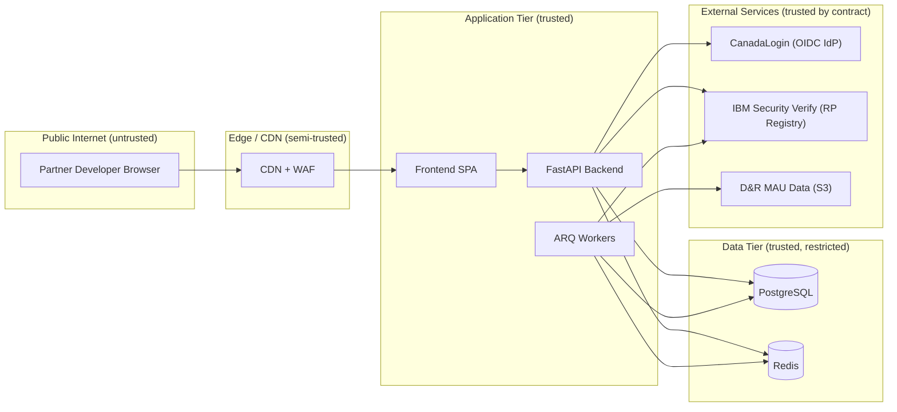

## DFD-1: OIDC Login Via CanadaLogin

All user sign-up, identity verification, passkey registration, and OTP validation are handled entirely by CanadaLogin (the OIDC IdP). The portal only consumes the resulting OIDC authorization code.

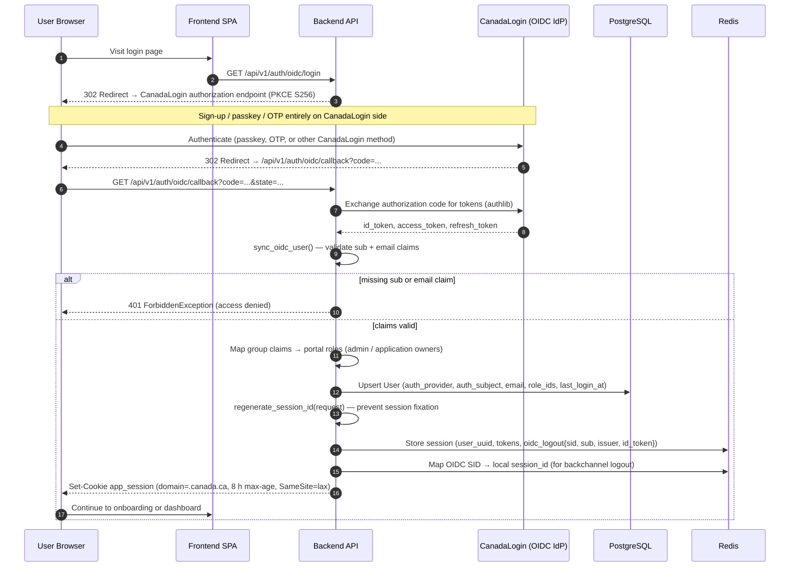

Edge cases:
- Missing `sub` claim → 401; missing `email` claim → 401 ForbiddenException.
- Absent group claim → user receives default (non-admin) role.
- PKCE `state` mismatch → authlib raises an error before token exchange.

## DFD-2: Department Selection And Terms Acceptance

These are portal-side post-login onboarding steps. Passkey registration is handled by CanadaLogin and does not appear here.

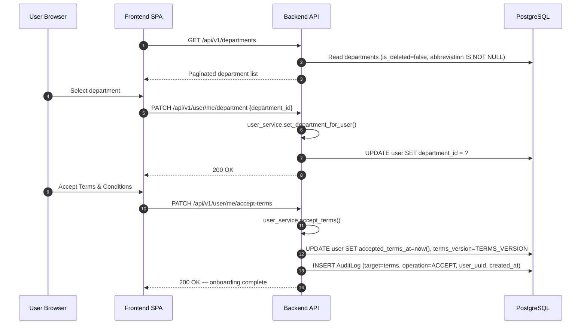

## DFD-3: RP Application Sync (ARQ Cron Job)

RP application configurations are imported and kept current by a background ARQ cron job. There is no user-initiated workspace setup step.

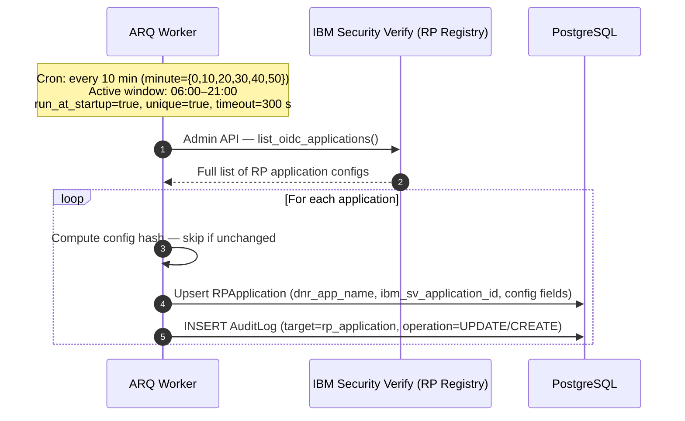

User read path (separate from the sync job):

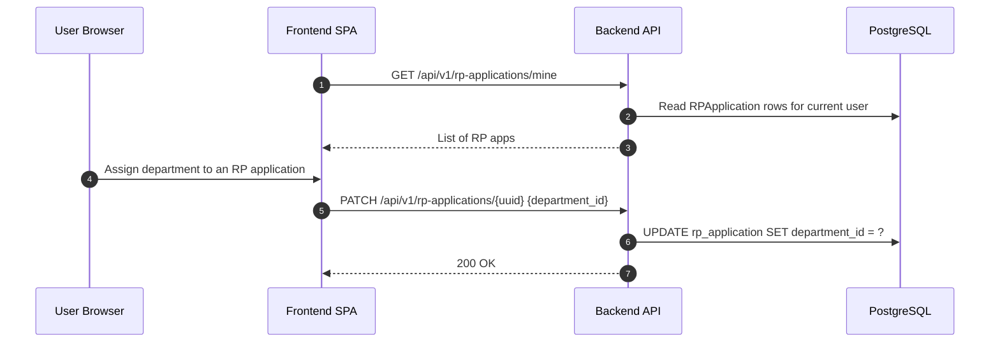

## DFD-4: View Client Credentials

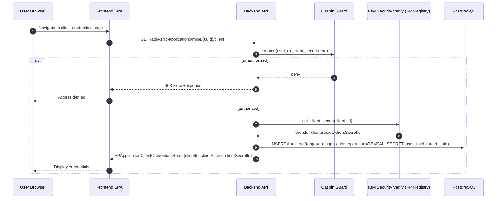

## DFD-5: Rotate Secret (Named, Old Secret Expires In 30 Days)

The user provides a description (name) for the rotation. The frontend computes `rotatedSecretExpiredAt = now + 30 days` (epoch seconds) before sending the request. Secrets are managed entirely in IBM Security Verify — no secret data is written to PostgreSQL.

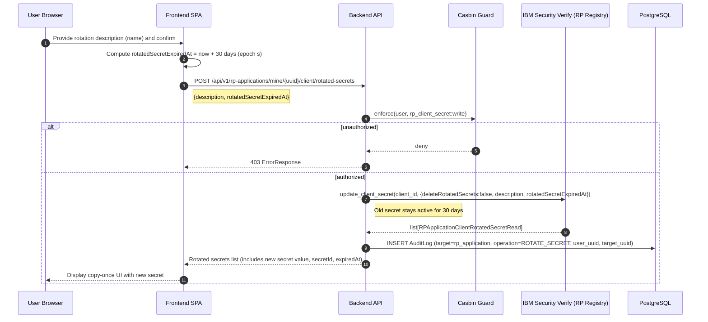

## DFD-6: Regenerate Secret (Immediate Replacement)

Generates a brand-new primary secret immediately. No description or expiry is provided — the service detects the empty payload and records `operation=REGENERATE` in the audit log. The old secret is invalidated immediately.

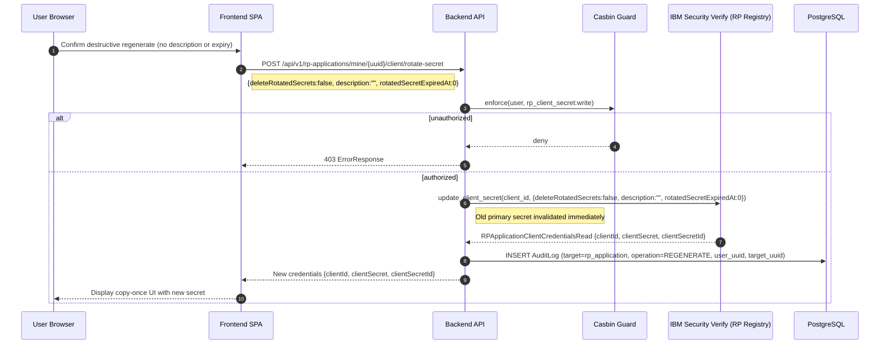

Error path: if IBM Verify call fails, the service raises an upstream-preserving error and emits a structured log for operator recovery. No partial state is written to the database.

## DFD-7: MAU Data Load (ARQ Cron Job)

MAU data is pre-loaded from the D&R S3 store into Redis by a background ARQ job. The API read path (DFD-8) only reads from Redis — it never calls S3 at request time.

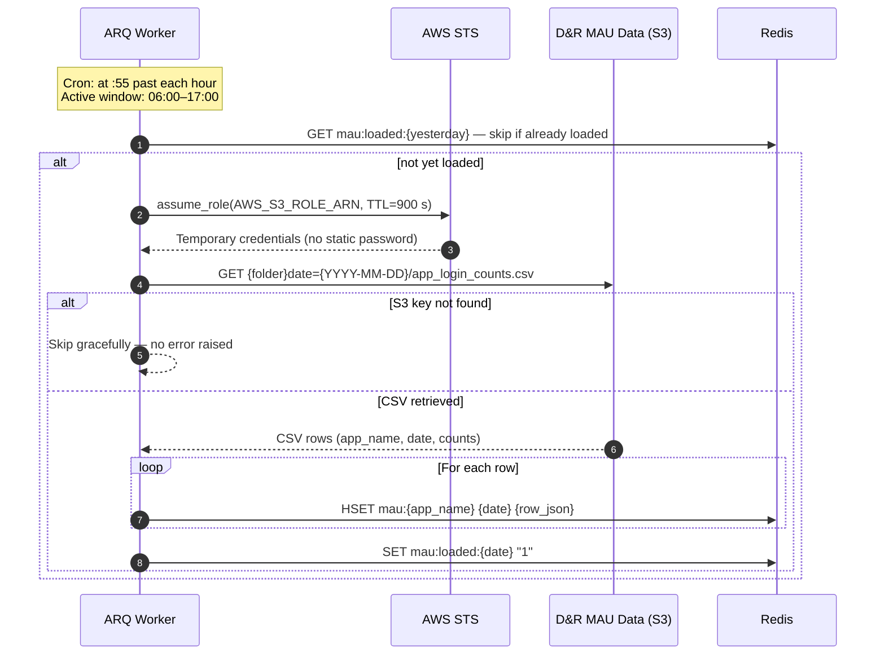

## DFD-8: MAU Usage Report Read

The read path is Redis-only. All data was pre-populated by the ARQ load job (DFD-7).

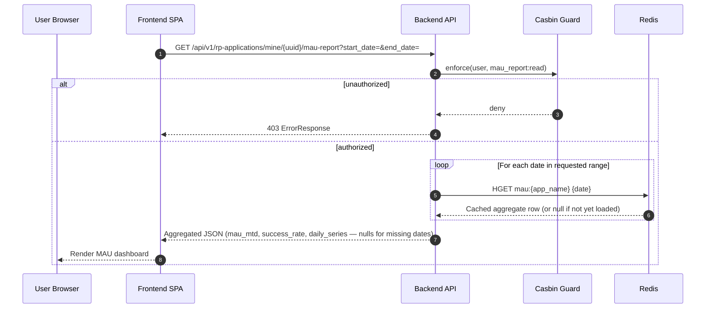

Edge cases:
- Redis miss for a date (load job has not run yet, or S3 key absent) → that date returns null; UI renders empty slot.
- Invalid date range → `BadRequestException`.

## DFD-9: Support And FAQ Outbound Links

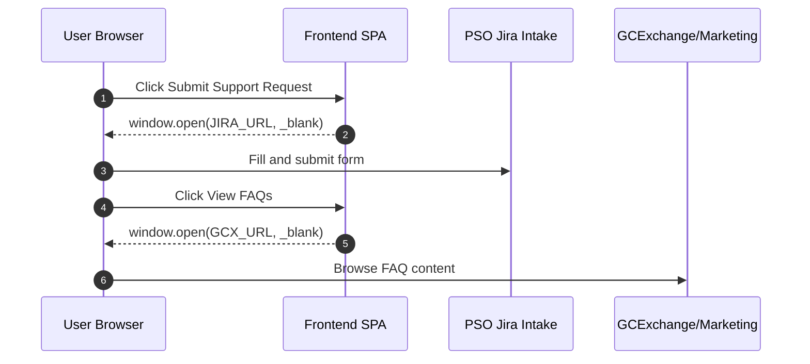

No portal data crosses to these surfaces beyond the user's own browser navigation.

## DFD-10: Authenticated Session Lifecycle (Cross-Cutting)

Sessions are managed by starsessions (Redis-backed). The cookie is `app_session` with `domain=.canada.ca`, `SameSite=lax`, 8-hour max-age, and `rolling=false`.

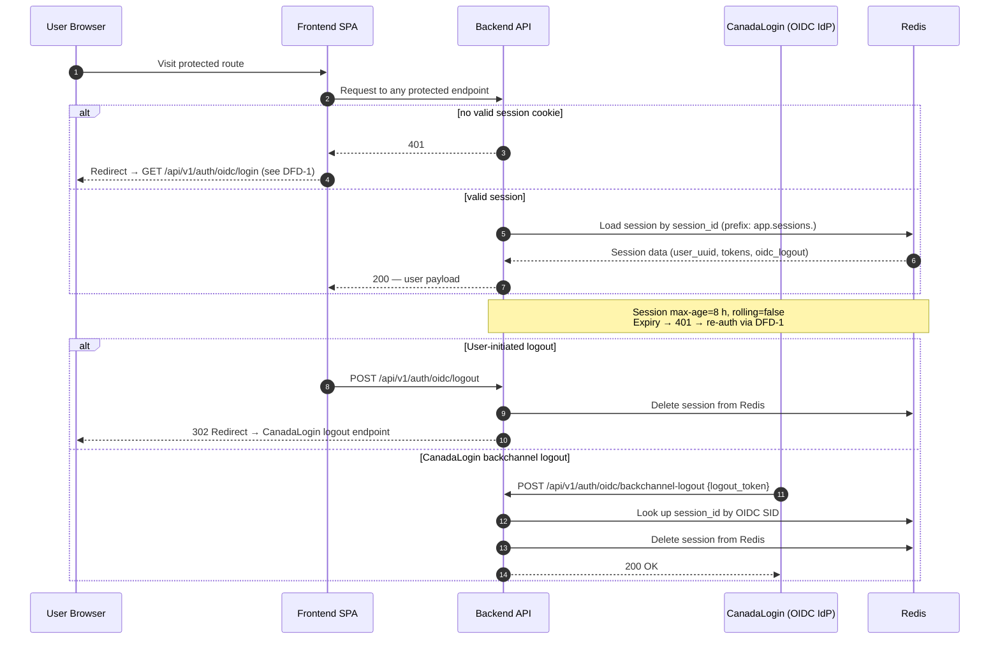

## DFD-11: Audit Log Writes For Secret And Terms Actions

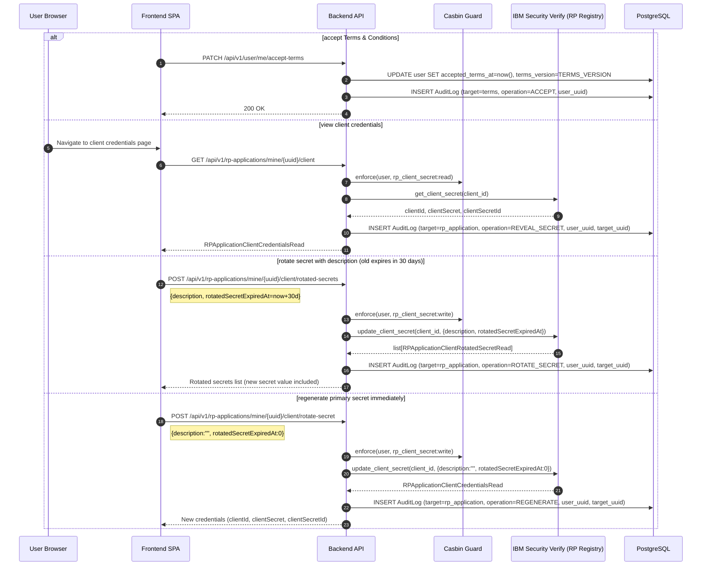

The audit trail is built from the server-side OIDC-authenticated session. Each entry records the authenticated user, the target RP application (where applicable), the action, and the outcome. Secrets themselves are never stored in PostgreSQL — only audit log entries are.

## Threat Modeling Hand-Off Notes

When importing these DFDs into Valentine, treat the following as primary assets and trust crossings:

- **Assets**: user identity (OIDC sub + email), session cookies, client secrets (at-rest in IBM Security Verify), MAU aggregates (in Redis + S3), terms acceptance records, audit log entries.
- **Trust crossings**: Browser → CDN, CDN → API, API → CanadaLogin (OIDC), API → IBM Security Verify (RP Registry), ARQ Worker → IBM Security Verify (RP sync), ARQ Worker → AWS STS → S3 (MAU load).
- **Highest-risk flows**: DFD-5 and DFD-6 (secret material returned over the wire), DFD-1 (OIDC callback code exchange), DFD-7 (IAM role assumption for S3 access).
