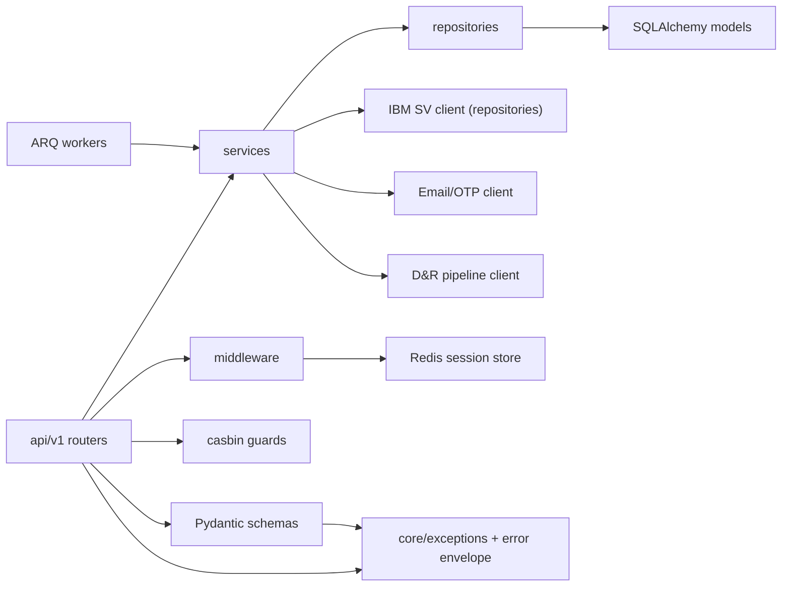
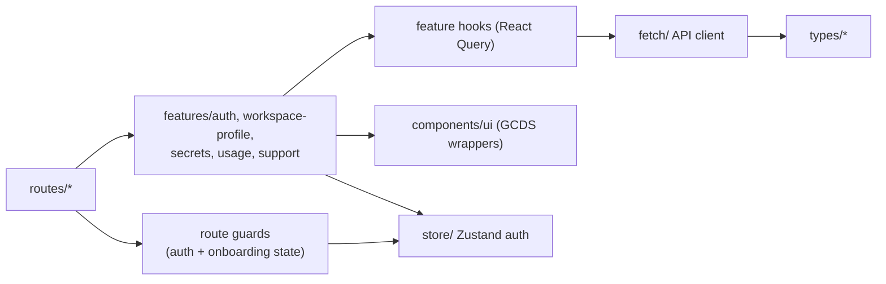

# Partner Portal MVP — Key Dependencies

## Purpose

This document captures the internal modules and external integrations the CanadaLogin Partner Portal MVP actually relies on. It is structured to be consumable by dependency management tooling: tables map directly to package manifests (`backend/pyproject.toml`, `frontend/package.json`) and to deployment-time service inventories.

## External Integrations (Runtime Services)

| Dependency | Type | Used By | MVP Purpose | Failure Mode |
|---|---|---|---|---|
| OIDC Identity Provider | SaaS | Backend `services/auth` | Sign-in for verified GC partners | Sign-in blocked → 503; users redirected to retry |
| IBM Security Verify | SaaS / REST API | Backend `services/verify`, ARQ worker | Source of truth for RP application ownership; secret rotate and regenerate | Onboarding import or secret operation fails → upstream error preserved in `ErrorResponse` |
| Email / OTP Provider | SaaS | Backend `services/auth`, ARQ worker | Email OTP delivery during sign-up | OTP send failure → user-facing retry; counters in Redis |
| D&R MAU Pipeline | Internal data service | Backend `services/usage` | MAU month-to-date, success rate, daily series | MAU read fails → cached aggregates or degraded UI |
| PSO Jira Intake | External link | Frontend `features/support` | Support request submission | Link only; portal continues to function |
| GCExchange / Marketing Site | External link | Frontend `features/support` | FAQ content | Link only; portal continues to function |
| PostgreSQL | Managed database | Backend repositories + Alembic migrations | Persistent state for users, departments, workspace profile, RP apps, secret rotations, terms acceptance | DB outage → backend returns 503; health endpoint fails |
| Redis | Managed cache / queue | Backend session middleware, ARQ, rate limiter, MAU cache | Sessions, OTP storage, async queue, caching | Redis outage → sign-in and async jobs fail; readiness flips unhealthy |

## Backend Internal Dependencies

These are the Python packages actually used in MVP-scoped code. Source: `backend/pyproject.toml`.

| Package | MVP Use |
|---|---|
| `fastapi` | API framework for `api/v1` routers |
| `uvicorn`, `gunicorn`, `uvloop`, `httptools` | ASGI runtime |
| `pydantic`, `pydantic-settings` | Request/response schemas, config |
| `SQLAlchemy`, `SQLAlchemy-Utils` | ORM models for User, Department, WorkspaceProfile, RpApplication, SecretRotation, TermsAcceptance |
| `alembic` | Schema migrations |
| `asyncpg`, `psycopg2-binary` | PostgreSQL drivers |
| `fastcrud` | Repository adapters |
| `redis[hiredis]`, `starsessions[redis]` | Session store + cache |
| `arq` | Async worker queue (Verify import, OTP send, MAU refresh) |
| `Authlib`, `PyJWT`, `itsdangerous` | OIDC client + token / cookie signing |
| `casbin-fastapi-decorator[db]` | Authorization guards for secret operations |
| `httpx` | Outbound calls to IBM Security Verify, OTP provider, D&R pipeline |
| `structlog`, `rich` | Structured logging |
| `uuid`, `uuid6` | Identifier generation |
| `python-multipart` | Form handling for sign-up flows |
| `python-dotenv` | Local config loading |

Dev/test only: `pytest`, `pytest-mock`, `faker`, `mypy`, `types-redis`, `ruff`.

## Frontend Internal Dependencies

These are the npm packages actually used in MVP-scoped code. Source: `frontend/package.json`.

| Package | MVP Use |
|---|---|
| `react`, `react-dom` | UI runtime |
| `@tanstack/react-router` | Route definitions and guards (auth, onboarding completion) |
| `@tanstack/react-query` | Data fetching for workspace profile, RP apps, secrets, usage |
| `zustand` | Auth/session state store |
| `react-hook-form`, `@hookform/resolvers`, `zod` | Forms for sign-up, department selection, secret rotation |
| `@gcds-core/components`, `@gcds-core/components-react`, `@gcds-core/css-shortcuts` | GCDS accessible UI primitives |
| `i18next`, `react-i18next`, `i18next-browser-languagedetector`, `i18next-http-backend` | Bilingual copy |
| `@nivo/line`, `@nivo/core` | MAU line chart (nice-to-have) |
| `dayjs` | Date handling for MAU month windows and secret expiry |

Dev/test only: `vite`, `vitest`, `@vitest/coverage-v8`, `@testing-library/*`, `@playwright/test`, `eslint`, `prettier`, `typescript`, `storybook`.

Out-of-MVP frontend packages currently present in the repo but not required by MVP journeys (e.g., `@tanstack/react-table`, `ag-grid-*`, `gridjs`, `tabulator-tables`, `simple-datatables`, `@nivo/bar`, `@nivo/pie`, `react-router-dom`) should be reviewed before launch and either kept for Phase 2 or removed.

## Internal Module Dependencies

### Backend Module Graph

### Frontend Module Graph

## Configuration Surface (Environment Variables)

| Variable | Component | Purpose |
|---|---|---|
| `ENVIRONMENT` | Backend | local / staging / production switch |
| `DATABASE_URL` | Backend | PostgreSQL connection |
| `REDIS_URL` | Backend | Sessions, queue, cache |
| `OIDC_CLIENT_ID`, `OIDC_CLIENT_SECRET`, `OIDC_DISCOVERY_URL` | Backend | OIDC client config |
| `OIDC_ACCESS_DENIED_REDIRECT` | Backend | Redirect for blocked sign-ins |
| `SESSION_IDLE_TTL`, `SESSION_ABSOLUTE_TTL` | Backend | Session timeout policy (PRD open question) |
| `IBM_SV_BASE_URL`, `IBM_SV_CLIENT_ID`, `IBM_SV_CLIENT_SECRET` | Backend | IBM Security Verify integration |
| `EMAIL_PROVIDER_API_KEY` | Backend | OTP delivery |
| `DNR_PIPELINE_URL`, `DNR_PIPELINE_TOKEN` | Backend | MAU data source |
| `SUPPORT_JIRA_URL` | Frontend | Support intake link |
| `FAQ_URL` | Frontend | FAQ link |
| `VITE_API_BASE_URL` | Frontend | Backend API base |

Secrets must never be committed; manage through the platform's secret store.

## Build And Tooling Dependencies

| Tool | Component | Use |
|---|---|---|
| `uv` | Backend | Dependency resolution and virtualenv |
| `make` (`bk-install`, `bk-test`, `bk-lint`, `bk-typecheck`, `bk-format`) | Backend | Standard task entry points |
| `pnpm` | Frontend | Package management |
| `vite`, `tsc` | Frontend | Build |
| `vitest`, `@playwright/test` | Frontend | Unit and e2e tests |
| `ruff`, `mypy`, `pytest` | Backend | Lint, type-check, test |
| `alembic` | Backend | DB migrations (revision ids ≤ 32 chars) |
| Docker Compose | Local dev | Orchestrates backend + Postgres + Redis |

## Dependency Risk Notes

1. IBM Security Verify availability directly gates onboarding and secret operations; circuit-breaking and retries should be reviewed for Phase 2.
2. The D&R MAU pipeline contract is not finalized; the integration boundary may shift before launch (PRD open question 6).
3. Passkey ceremonies depend on browser/authenticator capabilities; fallback policy must be confirmed (PRD open question 3).
4. Several frontend dependencies (multiple data-grid and chart libraries) are present but not required by MVP journeys; prune or scope to Phase 2 to reduce attack surface and bundle size.

## Related Documents

- [partner-portal-mvp.md](partner-portal-mvp.md)
- [partner-portal-mvp-architecture.md](partner-portal-mvp-architecture.md)
- [partner-portal-mvp-data-flows.md](partner-portal-mvp-data-flows.md)
