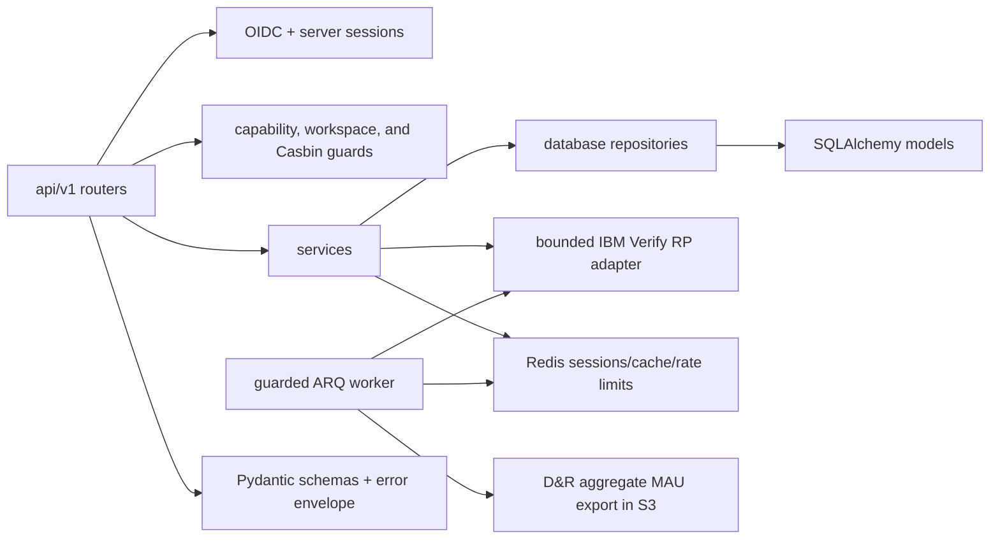
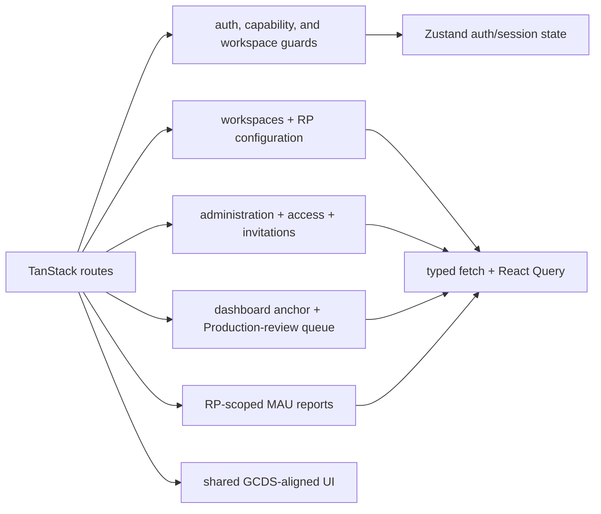

# Partner Portal MVP — Key Dependencies

## Purpose And Scope

This document records the dependencies used by the currently approved Partner
Portal MVP and onboarding scope. It follows the focused MVP and onboarding PRDs
plus the current implementation. The broader historical Partner Portal PRD is
not a source for adding runtime integrations or product administration
surfaces.

## External Integrations (Runtime Services)

| Dependency                            | Type                                    | Used By                                             | Approved Purpose                                                                                                                                                | Failure Mode                                                                                                          |
| ------------------------------------- | --------------------------------------- | --------------------------------------------------- | --------------------------------------------------------------------------------------------------------------------------------------------------------------- | --------------------------------------------------------------------------------------------------------------------- |
| OIDC identity provider                | SaaS                                    | Backend OIDC/session services                       | Authenticate users and supply verified identity claims; portal authorization still comes from canonical local assignments and grants                            | New sign-in or callback fails safely; protected portal data is not granted from upstream group claims                 |
| IBM Security Verify                   | SaaS / REST API                         | Bounded backend provider clients and guarded worker | Discover/adopt owned RP applications, apply supported RP setup, manage client secrets, and read RP-scoped login counts                                          | Only the affected RP adoption, configuration, credential, or usage operation fails with the normalized upstream error |
| D&R aggregate MAU export in Amazon S3 | Internal data pipeline / object storage | MAU worker and S3 repository                        | Load aggregate per-application MAU CSV data into the scoped report cache                                                                                        | Import is skipped or fails; the portal shows the scoped report's empty/error state without exposing individual users  |
| Atlassian/Jira service desk           | External link                           | Frontend support page                               | Open the PSO support intake form                                                                                                                                | Link-only dependency; the portal remains available                                                                    |
| PostgreSQL                            | Managed database                        | Backend repositories and Alembic migrations         | Persist identities, workspaces, fixed-role assignments, invitations, application data, RP configurations, Production-review metadata, and minimum audit history | Data-backed operations fail and `/api/v1/ready` reports unhealthy                                                     |
| Redis                                 | Managed data service                    | Session middleware, cache, ARQ, and rate limiter    | Server-side sessions, MAU cache, guarded jobs, and request limiting                                                                                             | Sign-in/session-dependent operations and affected jobs fail; `/api/v1/ready` reports unhealthy                        |

There is no GC Notify, email, or OTP-delivery dependency in the portal. An
authorized administrator copies a generated invitation link and shares it
through an approved channel. The portal validates the token and matches the
authenticated user's verified email during acceptance; it does not send the
link.

IBM Security Verify access is deliberately bounded to RP workflows. The portal
does not expose generic Verify users/groups/applications administration,
catalog or tier management, or a general provider administration console.

## Backend Internal Dependencies

Source: `backend/pyproject.toml`.

| Package                                                                               | Current Use                                                                        |
| ------------------------------------------------------------------------------------- | ---------------------------------------------------------------------------------- |
| `fastapi`                                                                             | Versioned API routers, dependency injection, request validation, and OpenAPI       |
| `uvicorn`, `gunicorn`, `uvloop`, `httptools`                                          | ASGI runtime                                                                       |
| `pydantic`, `pydantic-settings`                                                       | Request/response schemas and environment configuration                             |
| `SQLAlchemy`, `SQLAlchemy-Utils`, `alembic`, `asyncpg`, `psycopg2-binary`, `fastcrud` | PostgreSQL models, repositories, and migrations                                    |
| `redis[hiredis]`, `starsessions[redis]`                                               | Server-side sessions, cache, queue transport, and rate-limit storage               |
| `arq`                                                                                 | Guarded IBM RP import and aggregate MAU refresh jobs                               |
| `Authlib`, `PyJWT`, `itsdangerous`                                                    | OIDC client and signed/token support                                               |
| `casbin-fastapi-decorator[db]`                                                        | Coarse route guards alongside canonical capability and workspace authorization     |
| `ibm-verify-community-sdk`, `httpx`                                                   | Bounded IBM Verify provider operations and HTTP clients                            |
| `boto3`, `botocore`                                                                   | Read the approved aggregate MAU export from S3, including optional role assumption |
| `structlog`, `rich`                                                                   | Structured application logging and local log output                                |
| `uuid`, `uuid6`                                                                       | Identifier generation                                                              |
| `python-multipart`, `python-dotenv`                                                   | Form parsing and local environment-file loading                                    |

Development and verification dependencies include `pytest`, `pytest-mock`,
`faker`, `mypy`, `types-redis`, `ruff`, and `pre-commit`.

## Frontend Internal Dependencies

Source: `frontend/package.json`.

| Package                                                                                | Current Use                                                                                                                        |
| -------------------------------------------------------------------------------------- | ---------------------------------------------------------------------------------------------------------------------------------- |
| `react`, `react-dom`                                                                   | UI runtime                                                                                                                         |
| `@tanstack/react-router`                                                               | File-based routes, protected-route guards, and bounded saved-link redirects                                                        |
| `@tanstack/react-query`                                                                | Server-state queries and mutations for workspaces, access, invitations, RP configurations, Production review, credentials, and MAU |
| `zustand`                                                                              | Auth/session state                                                                                                                 |
| `react-hook-form`, `@hookform/resolvers`, `zod`                                        | Typed application, registration, access, and credential forms                                                                      |
| `@gcds-core/components`, `@gcds-core/components-react`, `@gcds-core/css-shortcuts`     | GC Design System components and layout utilities                                                                                   |
| `i18next`, `react-i18next`, `i18next-browser-languagedetector`, `i18next-http-backend` | English/French presentation and locale handling                                                                                    |
| `@nivo/line`, `@nivo/core`                                                             | RP-scoped MAU trend visualization                                                                                                  |
| `dayjs`                                                                                | Date handling where a feature needs it                                                                                             |

Development and verification dependencies include Vite, TypeScript, Vitest,
Testing Library, Playwright, ESLint, Prettier, Storybook, Tailwind, Husky,
Commitizen, and Commitlint.

Several packages remain installed without an approved MVP surface, including
extra chart/table or alternate-router packages. Empty historical feature
folders likewise do not make tier/catalog administration, generic audit
exploration, or broad reporting part of the product. These dependencies should
be pruned or justified separately before launch.

## Internal Module Dependencies

### Backend Module Graph

```mermaid
flowchart LR
    routers["api/v1 routers"] --> authn["OIDC + server sessions"]
    routers --> authz["capability, workspace, and Casbin guards"]
    routers --> services
    services --> repos["database repositories"]
    repos --> models["SQLAlchemy models"]
    services --> verify["bounded IBM Verify RP adapter"]
    services --> redis["Redis sessions/cache/rate limits"]
    worker["guarded ARQ worker"] --> verify
    worker --> s3["D&R aggregate MAU export in S3"]
    worker --> redis
    routers --> schemas["Pydantic schemas + error envelope"]
```

### Frontend Module Graph

```mermaid
flowchart LR
    routes["TanStack routes"] --> guards["auth, capability, and workspace guards"]
    routes --> workspaces["workspaces + RP configuration"]
    routes --> access["administration + access + invitations"]
    routes --> review["dashboard anchor + Production-review queue"]
    routes --> reports["RP-scoped MAU reports"]
    workspaces --> fetch["typed fetch + React Query"]
    access --> fetch
    review --> fetch
    reports --> fetch
    routes --> components["shared GCDS-aligned UI"]
    guards --> store["Zustand auth/session state"]
```

The route guards do not implement a generic onboarding lifecycle or readiness
score. Registration draft completion and explicit Production-review state are
separate contracts.

## Configuration Surface

| Variable                                                                                                        | Component             | Purpose                                                                                                  |
| --------------------------------------------------------------------------------------------------------------- | --------------------- | -------------------------------------------------------------------------------------------------------- |
| `ENVIRONMENT`, `SECRET_KEY`                                                                                     | Backend               | Environment gate and application signing secret                                                          |
| `POSTGRES_*` or `POSTGRES_URL`                                                                                  | Backend               | PostgreSQL connection                                                                                    |
| `REDIS_SESSION_*`, `REDIS_CACHE_*`, `REDIS_QUEUE_*`, `REDIS_RATE_LIMIT_*`                                       | Backend               | Session, cache, job, and rate-limit connections; optional values inherit the session Redis host settings |
| `OIDC_ENABLED`, `OIDC_SERVER_METADATA_URL`, `OIDC_CLIENT_ID`, `OIDC_CLIENT_SECRET`, `OIDC_SCOPES`               | Backend               | OIDC client and discovery configuration                                                                  |
| `OIDC_POST_LOGIN_REDIRECT`, `OIDC_ACCESS_DENIED_REDIRECT`, `OIDC_POST_LOGOUT_REDIRECT_URI`                      | Backend               | Browser return locations                                                                                 |
| `PARTNER_ACCESS_ALLOWED_EMAIL_DOMAINS`                                                                          | Backend               | Exact normalized email-domain allowlist required outside local/test                                      |
| `SESSION_MAX_AGE`, `SESSION_ROLLING`, `SESSION_COOKIE_*`                                                        | Backend               | Server-session and cookie policy                                                                         |
| `INITIAL_CL_ADMIN_EMAIL`                                                                                        | Backend setup command | Explicit one-time CL Admin bootstrap target; not an application-startup grant                            |
| `IBM_SV_ADMIN_BASE_URL`, `IBM_SV_ADMIN_CLIENT_ID`, `IBM_SV_ADMIN_CLIENT_SECRET`                                 | Backend               | Server credentials for the bounded IBM Verify RP adapter                                                 |
| `RP_APPLICATION_INVITE_URL_BASE`, `RP_APPLICATION_INVITATION_EXPIRE_DAYS`                                       | Backend               | Generate manually shared invitation links and set their expiry                                           |
| `LOAD_MAU_ENABLED`, `AWS_S3_REGION`, `AWS_S3_ROLE_ARN`, `AWS_S3_PROFILE`, `S3_MAU_BUCKET_NAME`, `S3_MAU_FOLDER` | Backend worker        | Guard and locate aggregate MAU ingestion                                                                 |
| `IBM_RP_APPLICATION_SYNC_ENABLED`                                                                               | Backend worker        | Local/test-only guard for the retained legacy RP import job; rejected in shared environments             |
| `CORS_ORIGINS`, `CORS_METHODS`, `CORS_HEADERS`                                                                  | Backend               | Exact credentialed browser origins and request surface                                                   |
| `VITE_API_BASE_URL`, `VITE_AUTH_POST_LOGIN_PATH`                                                                | Frontend              | Backend/proxy target and post-login path                                                                 |
| `VITE_SESSION_WARNING_AFTER_MINUTES`, `VITE_SESSION_COUNTDOWN_MINUTES`                                          | Frontend              | Inactivity warning and logout countdown presentation                                                     |

Secrets must never be committed. Shared environments must inject unique values
through the approved platform secret mechanism.

## Build And Tooling Dependencies

| Tool                      | Component         | Use                                                                         |
| ------------------------- | ----------------- | --------------------------------------------------------------------------- |
| `uv`                      | Backend           | Dependency resolution and repo-root virtual environment                     |
| `make`                    | Repository        | Stable backend, OpenAPI, and local-verification entry points                |
| `pnpm`                    | Frontend          | Package management and scripts                                              |
| Vite, TypeScript          | Frontend          | Development server and production build                                     |
| Vitest, Playwright        | Frontend          | Unit and end-to-end tests                                                   |
| Ruff, mypy, pytest        | Backend           | Format, static checks, and tests                                            |
| Alembic                   | Backend           | PostgreSQL migrations (revision IDs at most 32 characters)                  |
| Docker-compatible runtime | Local development | Optional service and container orchestration; Docker Desktop is not assumed |

## Dependency Risk Notes

1. IBM Security Verify availability and least-privilege client configuration
   directly affect RP adoption, provider configuration, credentials, and live
   usage queries. The adapter must remain workflow-bounded.
2. The aggregate D&R/S3 contract, freshness, and operational ownership must be
   confirmed before launch; reports must stay RP-scoped and identity-free.
3. Manual invitation sharing is an intentional launch dependency. Operations
   need an approved delivery channel and clear revoke/reissue guidance; the
   portal must not silently grow an email transport dependency.
4. Installed but unused chart, table, and alternate-router packages increase
   maintenance and supply-chain surface and should be reviewed before launch.

## Related Documents

- [CanadaLogin Partner Portal MVP PRD](partner-portal-mvp.md)
- [Partner Portal Onboarding PRD](partner-portal-onboarding-prd.md)
- [Partner Portal MVP Architecture](partner-portal-mvp-architecture.md)
- [Partner Portal MVP Data Flows](partner-portal-mvp-data-flows.md)
