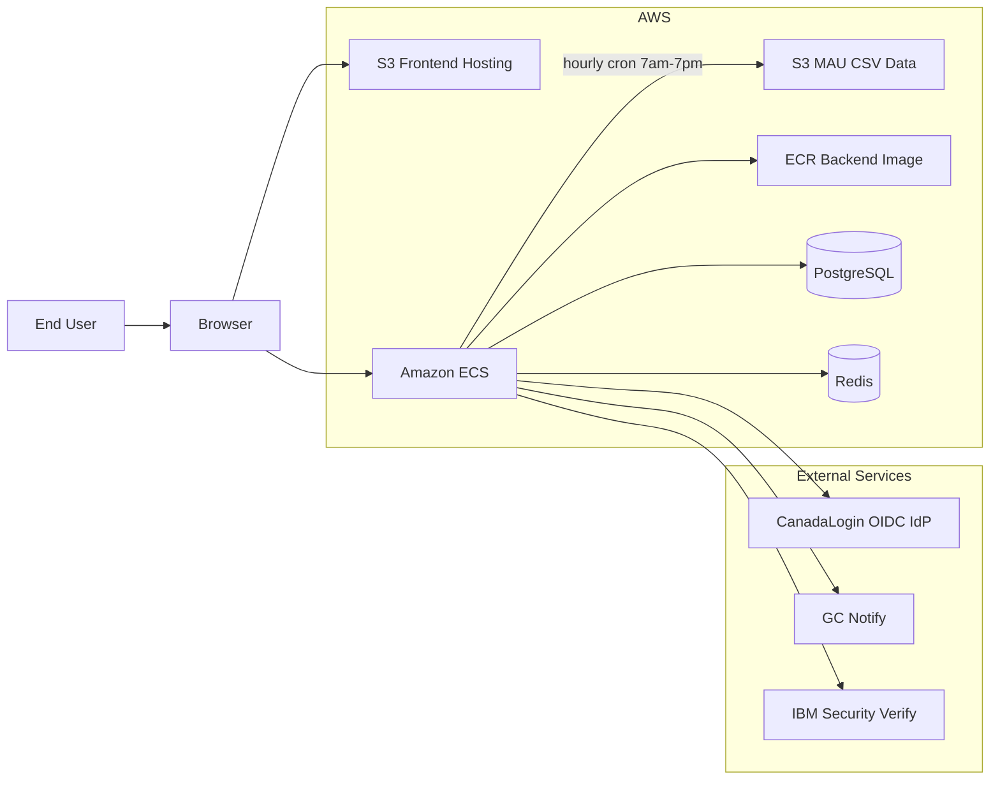

# CanadaLogin Partner Portal Infrastructure Architecture

## Document Status

- Status: Draft
- Date: 2026-05-28
- Purpose: High-level infrastructure handoff for AWS setup

## 1. Infrastructure Summary

CanadaLogin Partner Portal requires a simple web application setup on AWS with separate frontend and backend delivery targets.

- Frontend: static site build deployed to Amazon S3
- Backend: container image pushed to Amazon ECR and deployed to Amazon ECS
- Database: PostgreSQL
- Cache and session store: Redis
- External integrations: CanadaLogin OIDC identity provider, GC Notify, IBM Security Verify

Note: Amazon ECR is the image registry and Amazon ECS is the container runtime target.

## 2. Target AWS Topology

## 3. Required Infrastructure Components

### 3.1 Frontend

- Deploy the built frontend as static assets in Amazon S3.
- Serve the frontend over HTTPS.
- The frontend needs to call the backend API endpoint.

### 3.2 Backend

- Build the backend as a container image.
- Push the image to Amazon ECR.
- Deploy the container from ECR into Amazon ECS.
- The backend must have outbound access to PostgreSQL, Redis, CanadaLogin OIDC, GC Notify, and IBM Security Verify.

### 3.3 Data Services

- PostgreSQL for application data.
- Redis for backend runtime state.

Redis is used by the application for multiple purposes, but the infrastructure requirement is simply that a Redis service is available to the backend.

## 4. External Integrations

- CanadaLogin OIDC IdP: user authentication
- GC Notify: email notifications for invitation flow
- IBM Security Verify: RP application and client management

These are external dependencies and are not hosted inside AWS as part of this application stack.

## 5. Environment and Network Requirements

- Frontend must be reachable by end users over HTTPS.
- Backend API must be reachable by the frontend over HTTPS.
- Backend must be able to establish outbound connections to:
  - PostgreSQL
  - Redis
  - CanadaLogin OIDC endpoints
  - GC Notify API
  - IBM Security Verify API

## 6. Minimal Deployment Checklist

- S3 bucket for frontend deployment
- ECR repository for backend image
- ECS service or task for backend runtime
- PostgreSQL instance
- Redis instance
- DNS and TLS for frontend and backend endpoints
- Runtime configuration for external services:
  - CanadaLogin OIDC
  - GC Notify
  - IBM Security Verify

## 7. Recommendations From Env Samples

Based on `backend/.env.sample` and `frontend/.env.sample`, the infrastructure team should plan configuration in these groups.

### 7.1 Store As Secrets

- `POSTGRES_PASSWORD`
- `SECRET_KEY`
- `OIDC_CLIENT_SECRET`
- `IBM_SV_ADMIN_CLIENT_SECRET`
- `GC_NOTIFY_API_KEY`
- `REDIS_SESSION_PASSWORD` if Redis auth is enabled

These should be stored in AWS Secrets Manager or an equivalent secret store, not hardcoded in task definitions or deployment scripts.

### 7.2 Store As Runtime Configuration

- Backend database endpoint values: `POSTGRES_SERVER`, `POSTGRES_PORT`, `POSTGRES_DB`, `POSTGRES_USER`
- Redis endpoint values for session, cache, queue, and rate limiting
- OIDC metadata and client ID values
- IBM Security Verify base URL and client ID
- GC Notify template IDs and invite expiry settings
- Frontend variables: `VITE_APP_ENVIRONMENT`, `VITE_API_BASE_URL`, `VITE_AUTH_POST_LOGIN_PATH`

### 7.3 Production Recommendations

- Set `ENVIRONMENT` to `production` in deployed environments.
- Set `SESSION_COOKIE_SECURE=true` in production so session cookies are only sent over HTTPS.
- Replace `CORS_ORIGINS=["*"]` with the real frontend origin or origins.
- Set `OIDC_POST_LOGIN_REDIRECT` to the real frontend auth-complete URL.
- Set `RP_APPLICATION_INVITE_URL_BASE` to the public frontend invitation URL.
- Set `VITE_API_BASE_URL` to the public backend API origin unless the final setup is strictly same-origin and intentionally relies on browser-origin resolution.

### 7.4 Redis Recommendation

The backend sample exposes separate Redis settings for sessions, cache, queue. Infrastructure can back these with one managed Redis service if desired.
## 8. MAU Data Loading from S3

### 8.1 Overview

Monthly Active User (MAU) data is stored as CSV files on S3 and loaded into Redis cache via an ARQ cron job.

- **Source**: S3 bucket at `s3://{bucket}/{folder}/date={yyyy-mm-dd}/app_login_counts.csv`
- **CSV columns**: `application_name,total_logins,unique_users,failed_logins,successful_logins,mtd_unique_users,date`
- **Cache**: Redis hash under key `mau:{yyyy-mm-dd}` (field=app_name, value=mau_count), no TTL
- **Schedule**: ARQ cron job runs every hour from 7:00 to 19:00 (7am–7pm)

### 8.2 Data Flow

1. **Cron job**: ARQ worker triggers `load_mau_data` every hour between 7am and 7pm.
2. **Target date**: Always loads yesterday's data (`date.today() - 1 day`).
3. **Loaded check**: `EXISTS mau:loaded:{yesterday}` — if the key exists, skip loading.
4. **S3 fetch**: If not yet loaded, download `date={yesterday}/app_login_counts.csv` from the configured S3 folder path.
5. **Cache write**: Each CSV row is stored in `HSET mau:{application_name} {date} {full_record_json}` — keyed by app name for efficient queries by application + date range.
6. **Loaded flag**: Set `mau:loaded:{file_date}` to prevent redundant S3 fetches on subsequent cron runs.

### 8.3 Query Layer

- `MAUService.get_mau_by_application(name, start_date, end_date)` — queries a single app's MAU over a date range (default last 30 days). On cache miss, auto-loads the missing date from S3.
- `MAUService.get_mau_by_application(application_name, start_date, end_date)` — queries one app's MAU over a date range. Auto-loads missing dates from S3 on cache miss.

### 8.4 Configuration

| Variable | Description |
|---|---|
| `AWS_ACCESS_KEY_ID` | S3 access key |
| `AWS_SECRET_ACCESS_KEY` | S3 secret access key (store in Secrets Manager) |
| `AWS_S3_REGION` | S3 region (default: `ca-central-1`) |
| `S3_MAU_BUCKET_NAME` | Bucket containing MAU CSV files |
| `S3_MAU_FOLDER` | Folder path (default: `ibm_verify/app_login_counts/`) |

### 7.5 Frontend Routing Recommendation

The frontend sample shows that post-login routing is client-side.

- `VITE_AUTH_POST_LOGIN_PATH` should remain a frontend route such as `/dashboard`.
- `VITE_API_BASE_URL` should point to the backend origin, not the frontend S3 origin.