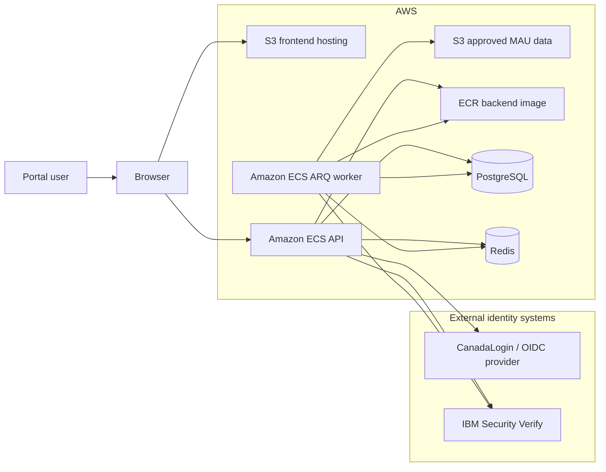

# CanadaLogin Partner Portal Infrastructure Architecture

## Document Status

- Status: Scope-aligned draft
- Last reviewed: 2026-08-28
- Purpose: High-level infrastructure handoff for the approved Partner Portal
  scope; it is not a production deployment approval
- Requirement sources: explicit approved decisions recorded in the active
  [`align-partner-portal-to-approved-product-scope`](../../openspec/changes/align-partner-portal-to-approved-product-scope/)
  change and confirmed expansions in the
  [onboarding PRD](partner-portal-onboarding-prd.md), then the
  [MVP PRD](partner-portal-mvp.md) as fallback

The broader [historical PRD](partner-portal-prd.md) and its derived backlog are
not architecture requirements.

## 1. Infrastructure Summary

The Partner Portal is a browser application with separate frontend, API, worker,
persistence, and cache/session responsibilities:

- Frontend: static React build deployed to Amazon S3 and served over HTTPS.
- Backend: FastAPI container image in Amazon ECR, run on Amazon ECS.
- Worker: separate ARQ process for queued and scheduled work.
- Database: PostgreSQL for portal-owned records and retained history.
- Redis: server sessions, cache entries, runtime rate-limit counters, and ARQ
  queue state.
- External integrations: CanadaLogin/OIDC for authentication and bounded IBM
  Security Verify operations for RP configuration and credentials.
- MAU source: approved S3 data pipeline consumed by the worker and API.

The portal does not send invitation email and does not require GC Notify.
Create and reissue operations return a one-time tokenized acceptance URL to the
authorized administrator, who shares it through an approved external channel.
That communication channel is an operational launch decision, not a portal
runtime dependency.

## 2. Illustrative AWS Topology

```mermaid
flowchart LR
    User[Portal user]
    Browser[Browser]

    subgraph AWS[AWS]
        S3Frontend[S3 frontend hosting]
        S3MAU[S3 approved MAU data]
        ECR[ECR backend image]
        API[Amazon ECS API]
        Worker[Amazon ECS ARQ worker]
        PG[(PostgreSQL)]
        Redis[(Redis)]
    end

    subgraph External[External identity systems]
        OIDC[CanadaLogin / OIDC provider]
        IBM[IBM Security Verify]
    end

    User --> Browser
    Browser --> S3Frontend
    Browser --> API
    API --> ECR
    Worker --> ECR
    API --> PG
    API --> Redis
    Worker --> Redis
    Worker --> PG
    API --> OIDC
    API --> IBM
    Worker --> IBM
    Worker --> S3MAU
```

This diagram is structure-oriented and illustrative. Account, region, VPC,
subnet, ingress, and production resilience decisions require a separate named
  environment design and approval. The detailed security boundary and permitted
  runtime flows are recorded in
  [trust-boundaries-and-information-flows.md](../architecture/trust-boundaries-and-information-flows.md).

## 3. Required Infrastructure Components

### 3.1 Frontend

- Deploy the built frontend as static assets.
- Serve it over HTTPS with the approved GC page shell and bilingual routes.
- Route API traffic to the backend without exposing provider tokens or secret
  values to browser storage.
- Apply a no-referrer policy so invitation bearer URLs are not propagated.

### 3.2 Backend API

- Build and publish the reviewed backend image to an approved registry.
- Run the FastAPI application as a managed container service.
- Provide outbound access to PostgreSQL, Redis, CanadaLogin/OIDC, IBM Security
  Verify, and the approved MAU data path only where required.
- Keep authentication, exact verified-email invitation matching, configured
  partner-domain admission, role and workspace authorization, and provider
  access in the backend boundary.

### 3.3 Worker

- Run ARQ independently from the web process.
- Use Redis for queue state and approved S3 data for MAU ingestion.
- Do not add notification-delivery work for invitations.

### 3.4 Data Services

- PostgreSQL stores users, immutable role references, assignments, workspaces,
  Applications, contacts, RP configurations, invitation hashes/history,
  checklist/CATS records when their mechanism is approved, registration
  completion metadata, Production-review records, and required audit history.
- Redis stores server sessions, caches, rate-limit counters, and ARQ queue
  state. Product tier/rate-limit catalog administration is not part of this
  scope; runtime rate limiting remains infrastructure.

## 4. External Integrations

| Integration              | Portal use                                                 | Boundary                                                          |
| ------------------------ | ---------------------------------------------------------- | ----------------------------------------------------------------- |
| CanadaLogin/OIDC         | Authenticate users and return verified identity claims     | Backend session only; the browser does not retain provider tokens |
| IBM Security Verify      | Bounded RP configuration, credential, and usage operations | Not a generic Verify administration console                       |
| Approved MAU S3 pipeline | Source scoped RP-configuration usage data                  | Retained MAU only; no cross-partner aggregate report family       |

The manual channel used by an administrator to share an invitation link is not
selected here and is not modelled as a portal integration.

## 5. Environment And Network Requirements

- Frontend and backend endpoints are reachable over HTTPS.
- The backend reaches PostgreSQL and Redis over private approved paths.
- Only the backend API initiates CanadaLogin/OIDC calls.
- The backend API and the explicitly enabled ARQ synchronization job may
  initiate bounded IBM Security Verify calls; the worker job only synchronizes
  approved RP metadata.
- Only the worker path that ingests MAU data needs access to the MAU bucket.
- Browser origins, callback URLs, cookie domains, invitation URL base, and
  partner email-domain allowlists are explicit per environment.
- Local development uses fake identities and data. Shared non-production and
  production need named targets, real secret sources, rollback, monitoring,
  privacy/security review, and human release approval.

## 6. Minimal Deployment Checklist

- Static frontend hosting and HTTPS delivery.
- ECR repository and separate ECS API/worker task definitions.
- PostgreSQL and Redis with backup, recovery, and access controls.
- DNS, TLS, CORS, secure-cookie, and OIDC callback configuration.
- IBM Verify bounded-adapter credentials and allowlisted endpoints.
- Approved MAU bucket access for the worker.
- Explicit `PARTNER_ACCESS_ALLOWED_EMAIL_DOMAINS` and
  `RP_APPLICATION_INVITE_URL_BASE` values.
- Database migration and rollback plan that preserves historical lifecycle,
  internal-review, and audit records until retention/disposition is approved.
- Logs and monitoring that exclude secret values, invitation tokens, and
  unnecessary personal information.

## 7. Configuration Guidance

### 7.1 Store As Secrets

- `POSTGRES_PASSWORD`
- `SECRET_KEY`
- `OIDC_CLIENT_SECRET`
- `IBM_SV_ADMIN_CLIENT_SECRET`
- Redis passwords when Redis authentication is enabled
- approved AWS workload credentials or role configuration for MAU access

Use AWS Secrets Manager or an equivalent approved secret store. Do not hardcode
secrets in task definitions, images, documentation, or frontend variables.

### 7.2 Store As Runtime Configuration

- PostgreSQL and Redis endpoints, database names, and non-secret identifiers.
- Redis endpoints for session, cache, queue, and runtime rate limiting.
- OIDC metadata, client ID, callbacks, and logout settings.
- IBM Security Verify base URL, client ID, and bounded adapter settings.
- `PARTNER_ACCESS_ALLOWED_EMAIL_DOMAINS` using exact domain values.
- invitation expiry and `RP_APPLICATION_INVITE_URL_BASE`.
- MAU S3 region, bucket, and folder identifiers.
- frontend environment, API base URL, and post-login route.

There are no GC Notify API keys or invitation template IDs in the required
runtime contract.

### 7.3 Production Recommendations

- Set `ENVIRONMENT=production` and secure session cookies.
- Use explicit frontend origins instead of wildcard CORS.
- Use the deployed frontend callback and invitation URL base.
- Use server-side secrets and workload identity for external systems.
- Verify exact-email/domain invitation acceptance and one-time-link response
  handling in the deployed environment without recording bearer URLs.
- Complete target-specific security, privacy, accessibility, bilingual,
  migration, backup, and rollback evidence before release.

### 7.4 Redis Recommendation

One managed Redis service may back sessions, cache, queue, and rate limiting if
isolation, authentication, availability, and operational ownership are
appropriate. Keep distinct logical clients/settings so a future split does not
change application contracts.

## 8. MAU Data Loading From S3

### 8.1 Overview

Approved MAU CSV data is loaded into Redis by an ARQ job and queried only for
an RP configuration the current role may access.

- Source pattern:
  `s3://{bucket}/{folder}/date={yyyy-mm-dd}/app_login_counts.csv`
- Expected columns:
  `application_name,total_logins,unique_users,failed_logins,successful_logins,mtd_unique_users,date`
- Cache key family: `mau:{application_name}` plus a loaded-date marker.
- Schedule: current worker configuration loads the prior day's data during the
  configured hourly window.

### 8.2 Data Flow

1. The ARQ worker selects the target date.
2. A loaded marker prevents duplicate ingestion.
3. The worker reads the approved CSV object.
4. Rows are cached by application name and date.
5. Scoped API routes read only the selected accessible RP configuration.

### 8.3 Query Boundary

`MAUService.get_mau_by_application(...)` reads a date range for one
application identifier and may load a missing date through the approved data
adapter. Portal discovery exposes only the safe hierarchy and environment
labels needed to reach that scoped report. Aggregate onboarding, invitation,
secret-hygiene, executive, or cross-workspace analytics are not part of this
architecture.

### 8.4 Configuration

| Variable             | Description                                       |
| -------------------- | ------------------------------------------------- |
| `AWS_S3_REGION`      | S3 region, currently defaulting to `ca-central-1` |
| `S3_MAU_BUCKET_NAME` | Bucket containing approved MAU CSV files          |
| `S3_MAU_FOLDER`      | Folder path for MAU objects                       |

Prefer an ECS task role to long-lived AWS access keys.

## 9. Frontend Routing Recommendation

Post-login routing remains client-side. `VITE_AUTH_POST_LOGIN_PATH` names a
frontend route, while `VITE_API_BASE_URL` names the backend origin unless the
deployment intentionally uses same-origin routing.
