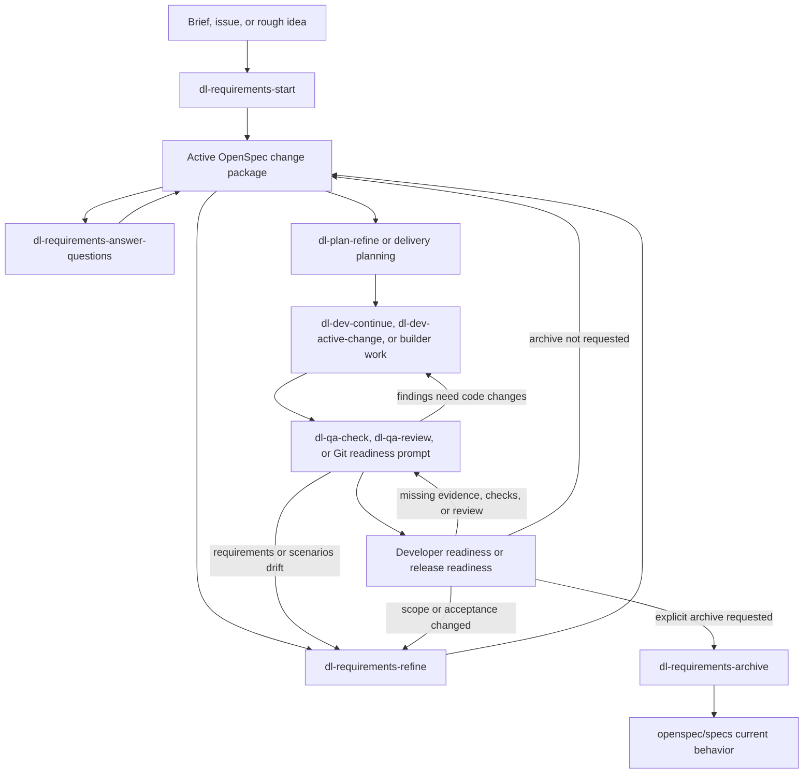
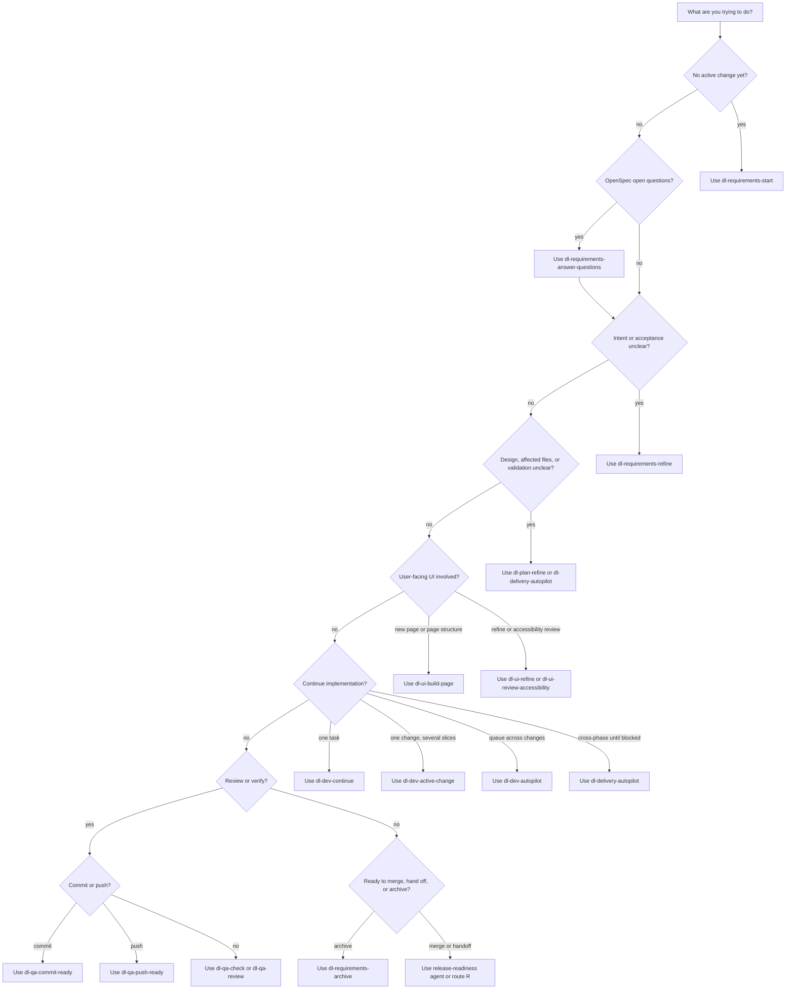
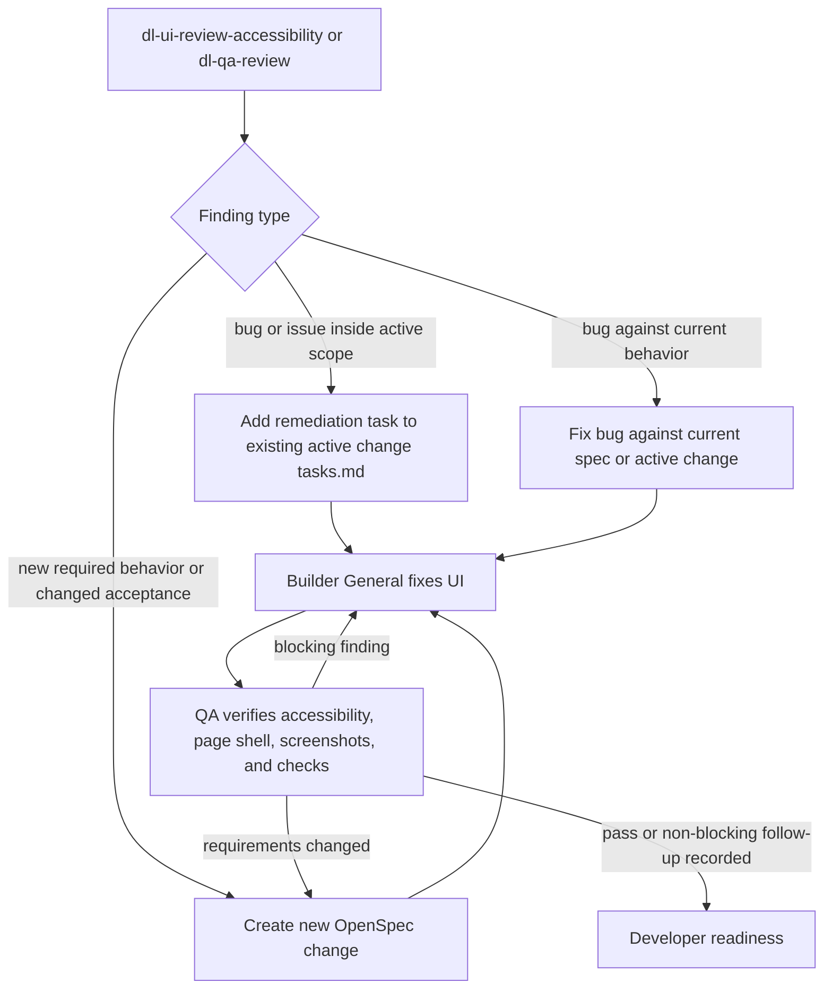
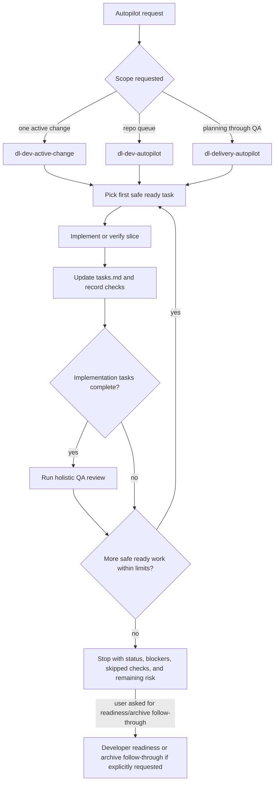

# Delorean Workflow Diagrams

Use this guide when you want to choose a prompt or understand how Delorean work
moves between Spec, Plan, Implement, Verify, and developer readiness.

At Level 2, readiness means lightweight developer readiness: review status,
local checks, OpenSpec validation/archive status, skipped checks, and remaining
risk. Level 3 is lightweight Delorean: change-state, gates/check tracking,
guided handoffs, and lightweight evidence summaries are active, while formal
release evidence and release packaging stay optional unless required by risk or
the user explicitly asks for them. Level 4 is full Delorean.

## Prompt Entry Points

| Starting point | Use when | Normal first phase |
|---|---|---|
| `dl-requirements-start` | A brief, issue, or rough idea needs a first OpenSpec change package. | Spec |
| `dl-requirements-refine` | Requirements, scenarios, tasks, or lifecycle state need cleanup. | Spec |
| `dl-requirements-answer-questions` | OpenSpec proposal, design, task, or spec-delta open questions need repo resolution and focused human feedback. | Spec |
| `dl-requirements-archive` | A completed OpenSpec change should be archived into current specs after verification. | Release-ready |
| `dl-plan-refine` | The design, impacted artifacts, validation strategy, or slice plan is unclear. | Plan |
| `dl-ui-build-page` | A new user-facing page, route, form, navigation path, or page shell is needed. | Plan |
| `dl-ui-refine` | Existing UI, route structure, accessibility, bilingual behavior, or UI evidence needs work. | Implement or Verify |
| `dl-ui-review-accessibility` | User-facing UI needs accessibility review or remediation findings. | Verify |
| `dl-dev-continue` | One active change exists and you want the next safe task. | Implement |
| `dl-dev-active-change` | One active change should keep working ready local slices until blocked, complete, or at the slice limit. | Implement |
| `dl-dev-autopilot` | The repo queue should scan active OpenSpec changes and continue ready slices across changes. | Implement |
| `dl-delivery-autopilot` | Planning blockers, implementation, QA, and review should continue across phases. | Spec or Plan, then Implement |
| `dl-qa-commit-ready` | Staged work needs pre-commit and commit-message checks before a local commit. | Verify |
| `dl-qa-push-ready` | Local commits need full pre-push checks before updating a remote branch. | Verify |
| `dl-qa-check` | Implementation needs local verification and skipped-check capture. | Verify |
| `dl-qa-review` | A broad review is needed before developer readiness, release-readiness, or handoff. | Verify |
| `release-readiness.agent.md` or route `R` | Verified work needs developer readiness, archive readiness, or formal release readiness. | Release-ready |

## Main Change Lifecycle



Archive is not automatic. A completed active change can be ready to archive,
but the archive step should be explicit through `dl-requirements-archive`
because it updates `openspec/specs/**` and moves the completed package under
`openspec/changes/archive/`.
For functional changes, inspect the branch diff after archive and confirm the
matching current spec was created or updated; `--skip-specs` is only for
intentional no-spec-update changes.

## Prompt Selection Flow



## UI Review And Remediation



Use a new OpenSpec change only when the review discovers new required behavior,
changed acceptance criteria, missing scenarios, or a page-pattern/accessibility
expectation that is not already represented by the active change or current
spec.

## Autopilot Loops



Autopilot should not silently archive. It may continue through developer
readiness and archive follow-through only when the user asks for that behavior,
for example:

```text
Run dev active change for <change-id> including lightweight developer readiness
and archive follow-through.
```

## Re-Entry Rules

| Finding | Re-enter |
|---|---|
| Requirement, scenario, scope, or acceptance drift | Spec |
| Design, affected artifact, page pattern, or validation strategy gap | Plan |
| Code, docs, contract, migration, UI, or test defect | Implement |
| Missing checks, failed checks, screenshots, review, or skipped-check rationale | Verify |
| Remaining risk, approval, waiver, formal release package, or archive status gap | Developer readiness or Release-ready |

At Level 2, unresolved gates, baseline evidence, and Evidence Bundle gaps are
usually readiness risks or opt-in follow-up. At Level 3, unresolved
change-state, gate/check, or lightweight evidence-summary gaps may block
developer readiness depending on `delorean/config.yaml`. At Level 4, those
same gaps may block formal release readiness.
